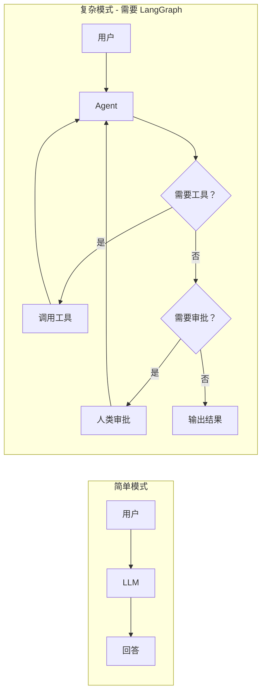
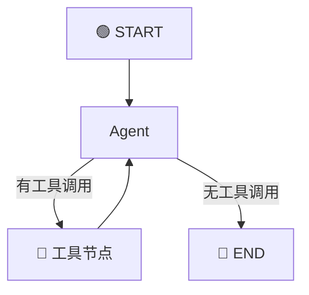
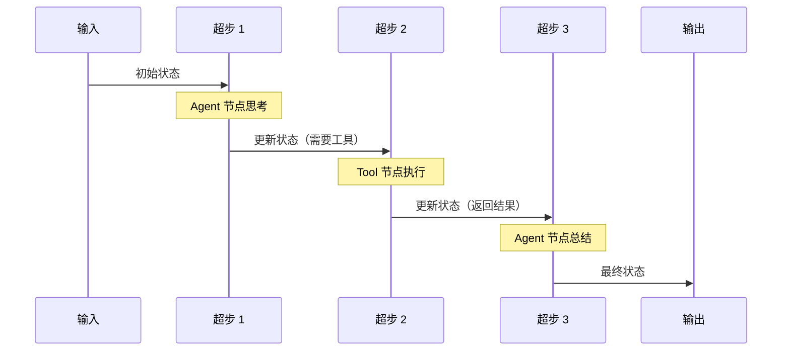
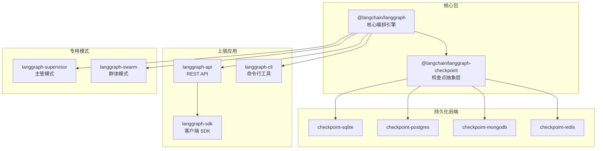

# 🌟 第一章：LangGraph 是什么？

> 本章将带你了解 LangGraph 的定位、它解决了什么问题、以及为什么你需要它。

---

## 📖 一句话概括

**LangGraph 是一个用于构建有状态（Stateful）、可控（Controllable）的 AI 智能体工作流的编排框架。**

如果把 AI 应用比作一个工厂的流水线，那么 LangGraph 就是这条流水线的**设计蓝图和调度系统**——它定义了每个工位（节点）做什么、产品（状态）如何在工位之间流转、以及在什么条件下走哪条路线。

---

## 🤔 为什么需要 LangGraph？

### 1. 简单的 LLM 调用不够用了

最初，我们用 LLM（大语言模型）做事很简单：

```
用户提问 → LLM 回答 → 完成
```

但随着 AI 应用变复杂，我们需要：

- 🔄 **多轮对话**：LLM 需要"记住"之前说了什么
- 🔧 **调用工具**：LLM 需要查数据库、调 API、搜索网页
- 🔀 **条件分支**：根据不同情况走不同路线
- 👥 **多代理协作**：多个 AI 专家一起解决问题
- ✋ **人类干预**：关键步骤需要人类审批



### 2. 现有方案的不足

| 方案 | 问题 |
|------|------|
| 纯代码手写 | 状态管理复杂、流程控制混乱、没有持久化 |
| LangChain Chains | 线性执行，不支持循环和复杂分支 |
| 简单的 DAG 框架 | 不支持循环、不支持状态管理 |

### 3. LangGraph 的解决方案

LangGraph 把复杂的 AI 工作流抽象成一张**图（Graph）**：



这张图有三个核心要素：
- **节点（Node）**：每个节点是一个处理步骤（函数）
- **边（Edge）**：定义节点之间的连接和流转方向
- **状态（State）**：在节点之间传递和共享的数据

---

## 🎯 LangGraph 的核心特性

### 1. 🔁 支持循环

> **为什么重要？** AI Agent 的核心模式就是"思考 → 行动 → 观察 → 再思考"的循环。

传统的 DAG（有向无环图）框架不支持循环，而 LangGraph 天然支持。

```typescript
// Agent 可以反复调用工具，直到得到满意的结果
graph.addEdge("tools", "agent"); // 工具执行完，回到 agent 继续思考
```

### 2. 📦 内置状态管理

> **为什么重要？** AI 应用需要在多个步骤之间共享和累积数据。

```typescript
// 定义状态：消息列表会自动累积
const StateAnnotation = Annotation.Root({
  messages: Annotation<BaseMessage[]>({
    reducer: (existing, newMsgs) => [...existing, ...newMsgs],
    default: () => [],
  }),
});
```

### 3. 💾 检查点与持久化

> **为什么重要？** 长时间运行的工作流需要在崩溃后恢复、支持人类审批等待。

```typescript
// 配置检查点，每一步自动保存状态
const compiled = graph.compile({
  checkpointer: new MemorySaver(),
});
```

### 4. 🤝 人机协作

> **为什么重要？** 关键决策需要人类参与，比如审批、确认、修正。

```typescript
// 在关键节点前暂停，等待人类输入
const compiled = graph.compile({
  interruptBefore: ["send_email"], // 发邮件前暂停
});
```

### 5. 🌊 流式输出

> **为什么重要？** 用户不想等整个流程结束才看到结果。

```typescript
// 实时查看每个节点的执行结果
for await (const chunk of await compiled.stream(input)) {
  console.log("实时更新:", chunk);
}
```

---

## 🏗️ LangGraph 的设计灵感

LangGraph 的设计受到了以下技术的启发：

| 灵感来源 | 借鉴内容 |
|---------|---------|
| [Google Pregel](https://research.google/pubs/pub37252/) | 分布式图计算的"超步"执行模型 |
| [Apache Beam](https://beam.apache.org/) | 数据流管道的处理模式 |
| [NetworkX](https://networkx.org/) | Python 图库的 API 设计风格 |

### 🧠 Pregel 模型类比

想象一个**传话游戏**：

1. 每个人（节点）只能看到传给自己的纸条（输入）
2. 每个人写好回复后，把纸条传给下一个人（输出）
3. 一轮传话结束后，如果还有人需要处理，就开始下一轮
4. 直到没有人再需要传话，游戏结束

这就是 Pregel 的**超步（Superstep）** 模型。LangGraph 把这个模型应用到 AI 工作流中：



---

## 🆚 与其他框架对比

| 特性 | LangGraph | LangChain Chains | AutoGen | CrewAI |
|------|-----------|------------------|---------|--------|
| 循环支持 | ✅ | ❌ | ✅ | ✅ |
| 状态管理 | ✅ 内置 | ❌ | 部分 | 部分 |
| 检查点/持久化 | ✅ 多后端 | ❌ | ❌ | ❌ |
| 人机协作 | ✅ 原生支持 | ❌ | 部分 | ❌ |
| 流式输出 | ✅ 多模式 | ✅ 基础 | 部分 | 部分 |
| 类型安全 | ✅ TypeScript | ✅ | ❌ (Python) | ❌ (Python) |
| 低级可控性 | ✅ | ❌ | ❌ | ❌ |
| 可视化 | ✅ Mermaid | ❌ | ❌ | ❌ |

---

## 🌍 谁在使用 LangGraph？

许多知名企业在生产环境中使用 LangGraph：

- 🔧 **Replit** - AI 编程助手
- 🚗 **Uber** - 内部 AI 工具
- 💼 **LinkedIn** - AI 功能
- 🦊 **GitLab** - AI 代码审查
- 💳 **Klarna** - AI 客服
- 🔍 **Elastic** - AI 搜索

---

## 📦 LangGraph.js 生态系统



---

## 🎬 下一步

现在你已经了解了 LangGraph 是什么、为什么需要它。接下来，让我们深入了解它的核心概念：

👉 [第二章：核心概念总览](./02-core-concepts.md)

---

[📖 返回目录](./README.md) | [下一章 →](./02-core-concepts.md)
