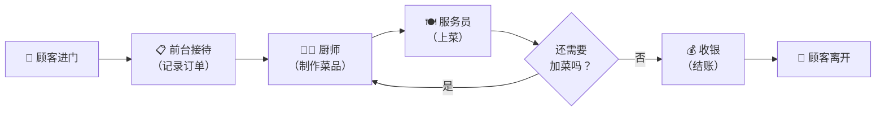
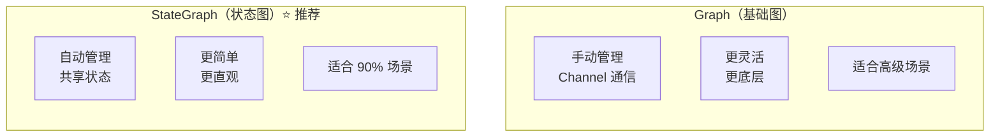
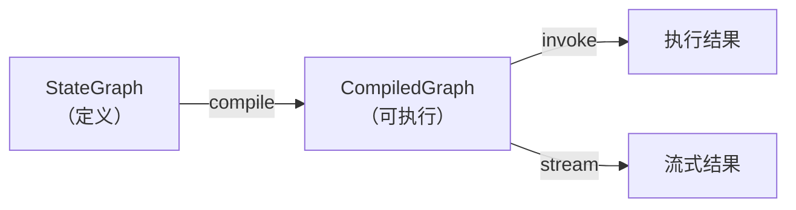
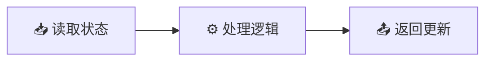
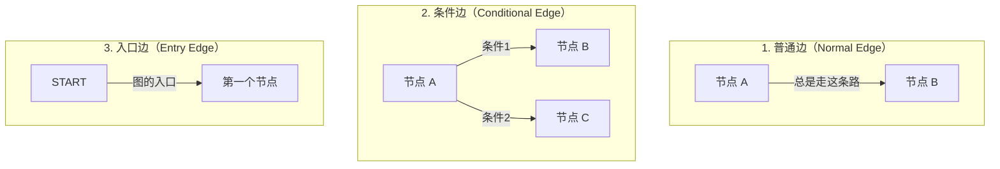
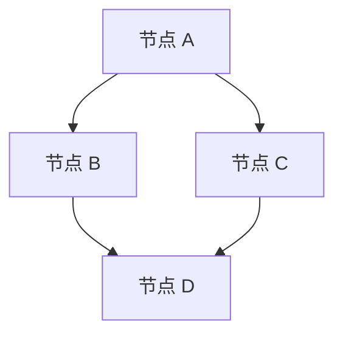
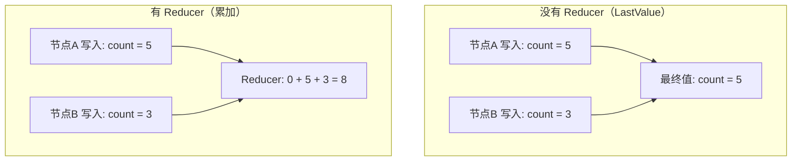
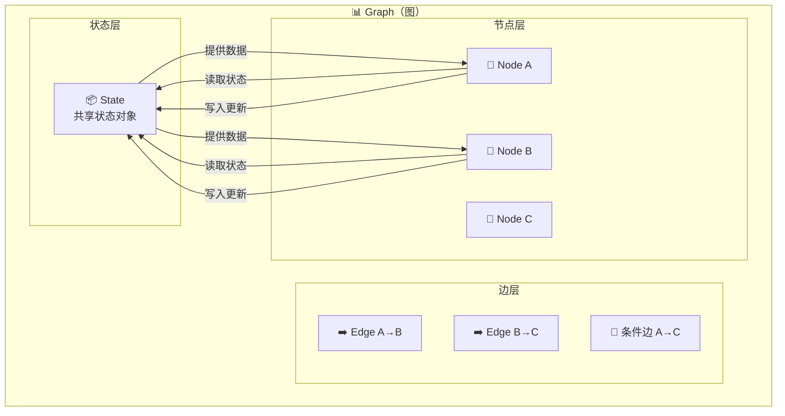
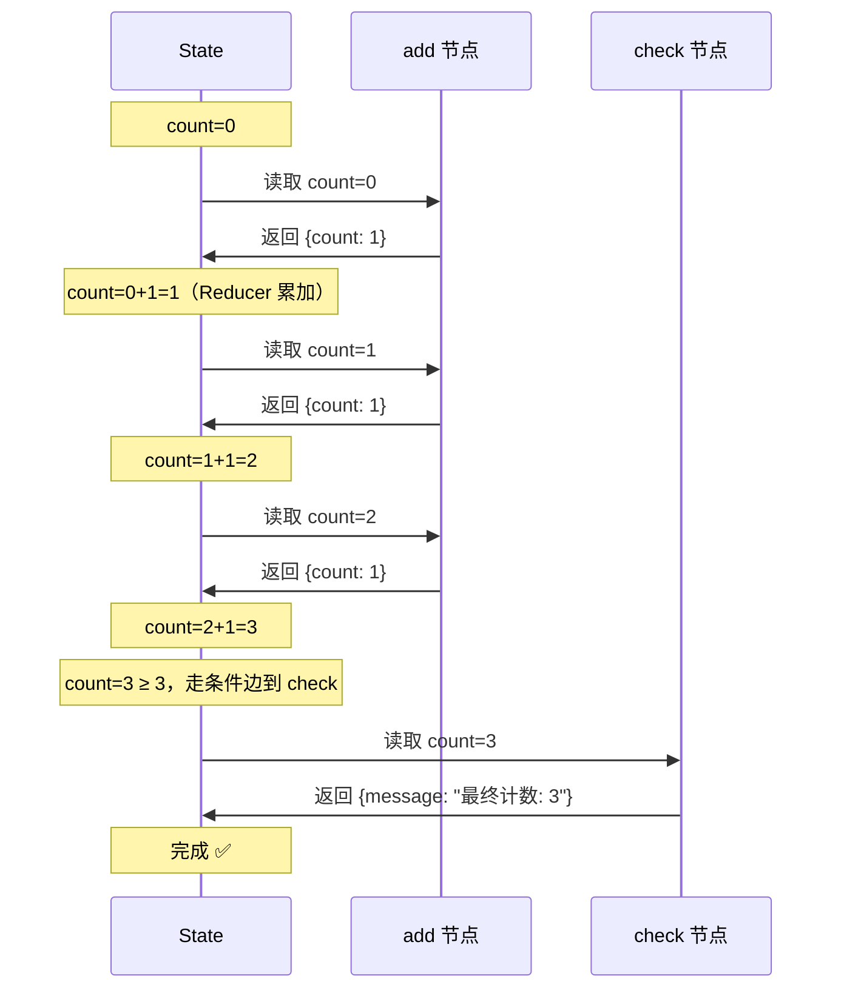

# 🧩 第二章：核心概念总览

> 本章将介绍 LangGraph 的四大核心概念：图（Graph）、节点（Node）、边（Edge）、状态（State），并解释它们之间的关系。

---

## 🎯 本章目标

理解 LangGraph 的核心组成部分，能够用自然语言描述一个 LangGraph 应用的结构。

---

## 🏠 先用一个生活类比理解

想象你开了一家**餐厅**：

| LangGraph 概念 | 餐厅类比 | 说明 |
|---------------|---------|------|
| **Graph（图）** | 整个餐厅流程 | 从顾客进门到离开的完整流程 |
| **Node（节点）** | 工位/岗位 | 前台接待、厨师、服务员、收银员 |
| **Edge（边）** | 流程箭头 | 前台→厨房→上菜→收银 |
| **State（状态）** | 订单/工单 | 记录了顾客点了什么、做到哪一步、总价多少 |



在这个例子中：
- **订单**（State）从前台创建后，在每个工位之间传递
- 每个工位（Node）会读取和修改订单信息
- 如果顾客要**加菜**，流程会循环回去

---

## 1️⃣ Graph（图）

### 什么是图？

**图（Graph）** 是 LangGraph 的顶层容器，它定义了整个工作流的结构。一个图由节点和边组成。

### 两种图类型

LangGraph 提供了两种图类型：



> 💡 **建议**：几乎所有情况下都使用 `StateGraph`，除非你有非常特殊的需求。

### 代码示例

```typescript
import { StateGraph, Annotation, START, END } from "@langchain/langgraph";

// 使用 StateGraph（推荐）
const graph = new StateGraph(MyStateAnnotation)
  .addNode("step1", step1Function)
  .addNode("step2", step2Function)
  .addEdge(START, "step1")
  .addEdge("step1", "step2")
  .addEdge("step2", END);

// 编译后才能执行
const compiled = graph.compile();
```

### 为什么需要编译（compile）？

`graph.compile()` 做了以下事情：

1. **验证图结构**：检查是否有孤立节点、无效的边
2. **构建执行引擎**：将图转换为 Pregel 执行器
3. **配置检查点**：设置持久化策略
4. **优化执行路径**：确定哪些节点可以并行



---

## 2️⃣ Node（节点）

### 什么是节点？

**节点（Node）** 是图中的一个处理单元，本质上就是一个**函数**。

```typescript
// 一个简单的节点函数
const greetNode = async (state: { name: string }) => {
  return { greeting: `你好，${state.name}！` };
};
```

### 节点的工作方式

每个节点做三件事：



1. **读取状态**：接收当前状态作为输入参数
2. **处理逻辑**：执行任意逻辑（调用 LLM、查数据库、计算等）
3. **返回更新**：返回一个**部分状态对象**，用于更新共享状态

### 节点返回的是"部分状态"

这是一个重要的设计决策。节点不需要返回完整的状态，只需要返回**它修改的部分**：

```typescript
// ❌ 不需要返回完整状态
const badNode = async (state) => {
  return {
    messages: state.messages, // 不需要！
    count: state.count,       // 不需要！
    newField: "hello",        // 只有这个是新的
  };
};

// ✅ 只返回修改的部分
const goodNode = async (state) => {
  return {
    newField: "hello", // 只返回需要更新的字段
  };
};
```

> 🤔 **为什么这样设计？**
> - 减少数据传输量
> - 避免并发更新冲突
> - 让 Reducer（归约器）决定如何合并

### 特殊节点

LangGraph 有两个内置的特殊节点：

| 节点 | 常量名 | 说明 |
|------|-------|------|
| 起始节点 | `START` (`"__start__"`) | 图的入口，接收初始输入 |
| 结束节点 | `END` (`"__end__"`) | 图的出口，表示执行完成 |

```typescript
import { START, END } from "@langchain/langgraph";

graph.addEdge(START, "first_node");  // 从起始节点连接到第一个节点
graph.addEdge("last_node", END);      // 从最后一个节点连接到结束节点
```

---

## 3️⃣ Edge（边）

### 什么是边？

**边（Edge）** 定义了节点之间的连接关系，决定了数据的流转方向。

### 三种边类型



#### 普通边

最简单的连接，A 执行完**一定**去 B：

```typescript
graph.addEdge("agent", "formatter"); // agent 执行完，总是去 formatter
```

#### 条件边

根据节点的输出**动态决定**下一步去哪：

```typescript
graph.addConditionalEdges(
  "agent", // 源节点
  (state) => {
    // 路由函数：根据状态决定下一步
    if (state.messages.at(-1)?.tool_calls?.length > 0) {
      return "tools";
    }
    return "__end__";
  }
);
```

#### 入口边

连接 `START` 到第一个节点：

```typescript
graph.addEdge(START, "agent"); // 图开始时，先执行 agent 节点
```

### 边的执行顺序

当一个节点有多条出边时：



在上面的例子中，B 和 C 可以**并行执行**，D 会等 B 和 C 都完成后才执行。

---

## 4️⃣ State（状态）

### 什么是状态？

**状态（State）** 是在所有节点之间共享的数据对象。它就像一张不断更新的工单。

### 用 Annotation 定义状态

LangGraph 使用 `Annotation` 来定义状态的结构：

```typescript
import { Annotation } from "@langchain/langgraph";

const MyStateAnnotation = Annotation.Root({
  // 简单值：后写入的覆盖先写入的（LastValue 策略）
  userName: Annotation<string>,

  // 带 Reducer：自定义合并逻辑
  messages: Annotation<string[]>({
    reducer: (existing, newMsgs) => [...existing, ...newMsgs],
    default: () => [],
  }),

  // 数字计数器
  count: Annotation<number>({
    reducer: (current, update) => current + update,
    default: () => 0,
  }),
});
```

### 🧠 Reducer（归约器）是什么？

Reducer 决定了当多个节点更新同一个字段时，如何**合并**这些更新。



> 🤔 **为什么需要 Reducer？**
>
> 想象你有一个聊天应用，多个节点都会产生消息。如果没有 Reducer，后面的消息会覆盖前面的。有了 Reducer（`concat`），所有消息会按顺序拼接起来。

### 常见的 Reducer 模式

| 模式 | Reducer | 使用场景 |
|------|---------|---------|
| 覆盖（默认） | 无需指定 | 最新值覆盖旧值，如 `currentStep` |
| 追加 | `(a, b) => [...a, ...b]` | 消息历史、日志列表 |
| 累加 | `(a, b) => a + b` | 计数器、总分 |
| 合并对象 | `(a, b) => ({...a, ...b})` | 配置、元数据 |
| 去重追加 | `(a, b) => [...new Set([...a, ...b])]` | 标签、分类 |

---

## 🔗 四大概念的关系



**工作流程**：

1. `Graph` 包含所有的 `Node` 和 `Edge`
2. `Edge` 定义了 `Node` 之间的连接和流转规则
3. `State` 是所有 `Node` 共享的数据容器
4. 每个 `Node` 读取 `State`，执行逻辑，返回 `State` 的更新
5. Reducer 负责将更新合并到 `State` 中

---

## 🧪 完整示例：一个简单的计数器

让我们把四个概念结合起来，做一个简单的计数器：

```typescript
import { StateGraph, Annotation, START, END } from "@langchain/langgraph";

// 1️⃣ 定义状态
const CounterState = Annotation.Root({
  count: Annotation<number>({
    reducer: (current, update) => current + update,
    default: () => 0,
  }),
  message: Annotation<string>,
});

// 2️⃣ 定义节点
const addOne = async (state: typeof CounterState.State) => {
  console.log(`当前计数: ${state.count}`);
  return { count: 1, message: `计数变为 ${state.count + 1}` };
};

const checkCount = async (state: typeof CounterState.State) => {
  return { message: `最终计数: ${state.count}` };
};

// 3️⃣ 构建图
const graph = new StateGraph(CounterState)
  .addNode("add", addOne)
  .addNode("check", checkCount)
  .addEdge(START, "add")
  .addConditionalEdges("add", (state) => {
    // 4️⃣ 条件边：如果计数 < 3，继续加；否则去检查
    return state.count < 3 ? "add" : "check";
  })
  .addEdge("check", END);

// 5️⃣ 编译并执行
const compiled = graph.compile();
const result = await compiled.invoke({ count: 0 });
console.log(result);
// 输出: { count: 3, message: "最终计数: 3" }
```

**执行流程**：



---

## 📝 本章小结

| 概念 | 本质 | 关键特点 |
|------|------|---------|
| **Graph** | 工作流容器 | 需要 `compile()` 后才能执行 |
| **Node** | 处理函数 | 读取状态 → 处理 → 返回部分更新 |
| **Edge** | 连接关系 | 支持普通边、条件边 |
| **State** | 共享数据 | 通过 Annotation + Reducer 定义 |

---

## 🎬 下一步

现在你已经理解了四大核心概念，让我们动手实践，构建第一个真正有用的图：

👉 [第三章：快速上手](./03-quick-start.md)

---

[← 上一章](./01-introduction.md) | [📖 返回目录](./README.md) | [下一章 →](./03-quick-start.md)
