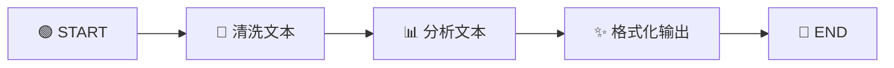
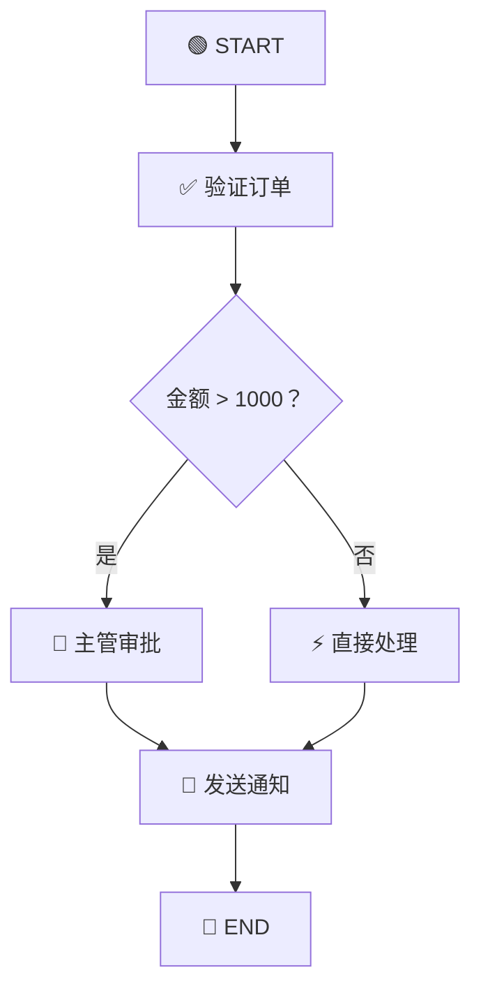

# 🚀 第三章：快速上手 —— 构建你的第一个 LangGraph 图

> 本章将通过一个完整的实战示例，带你动手构建第一个 LangGraph 应用。

---

## 🎯 本章目标

- 搭建开发环境
- 构建一个简单的工作流图
- 理解图的编译和执行过程
- 学会使用 `invoke` 和 `stream` 两种执行方式

---

## 📦 环境准备

### 第一步：初始化项目

```bash
mkdir my-langgraph-app
cd my-langgraph-app
npm init -y
npm install @langchain/langgraph @langchain/core
npm install -D typescript tsx
```

### 第二步：创建 tsconfig.json

```json
{
  "compilerOptions": {
    "target": "ES2021",
    "module": "NodeNext",
    "moduleResolution": "NodeNext",
    "strict": true,
    "esModuleInterop": true,
    "outDir": "./dist"
  },
  "include": ["src/**/*"]
}
```

---

## 🧪 示例一：文本处理流水线

让我们先从一个**不依赖 LLM** 的简单例子开始，理解 LangGraph 的工作方式。

### 场景描述

构建一个文本处理流水线：**输入文本 → 清洗 → 分析 → 格式化输出**



### 完整代码

```typescript
import { StateGraph, Annotation, START, END } from "@langchain/langgraph";

// ============ 第1步：定义状态 ============
const TextState = Annotation.Root({
  // 原始输入文本
  rawText: Annotation<string>,

  // 清洗后的文本
  cleanedText: Annotation<string>,

  // 分析结果
  analysis: Annotation<{
    wordCount: number;
    charCount: number;
    sentences: number;
  }>,

  // 最终格式化的输出
  output: Annotation<string>,
});

// ============ 第2步：定义节点函数 ============

// 🧹 清洗节点：去除多余空格、特殊字符
const cleanText = async (state: typeof TextState.State) => {
  const cleaned = state.rawText
    .trim()
    .replace(/\s+/g, " ") // 多个空格变一个
    .replace(/[^\w\s\u4e00-\u9fff，。！？、：；""''（）]/g, ""); // 保留中英文和标点

  console.log("🧹 清洗完成:", cleaned);
  return { cleanedText: cleaned };
};

// 📊 分析节点：统计文本信息
const analyzeText = async (state: typeof TextState.State) => {
  const text = state.cleanedText;
  const analysis = {
    wordCount: text.split(/\s+/).length,
    charCount: text.length,
    sentences: (text.match(/[.!?。！？]/g) || []).length || 1,
  };

  console.log("📊 分析完成:", analysis);
  return { analysis };
};

// ✨ 格式化节点：生成最终报告
const formatOutput = async (state: typeof TextState.State) => {
  const { analysis, cleanedText } = state;
  const output = `
📝 文本分析报告
================
📄 原文（清洗后）: ${cleanedText}
📏 字符数: ${analysis.charCount}
📖 词数: ${analysis.wordCount}
📃 句数: ${analysis.sentences}
📐 平均每句字符数: ${Math.round(analysis.charCount / analysis.sentences)}
================`;

  console.log("✨ 格式化完成");
  return { output };
};

// ============ 第3步：构建图 ============
const graph = new StateGraph(TextState)
  // 添加节点
  .addNode("clean", cleanText)
  .addNode("analyze", analyzeText)
  .addNode("format", formatOutput)
  // 添加边
  .addEdge(START, "clean")
  .addEdge("clean", "analyze")
  .addEdge("analyze", "format")
  .addEdge("format", END);

// ============ 第4步：编译 ============
const app = graph.compile();

// ============ 第5步：执行 ============
const result = await app.invoke({
  rawText: "  Hello World!   这是一个  测试文本。  包含多余的   空格。  ",
});

console.log(result.output);
```

### 运行结果

```
🧹 清洗完成: Hello World 这是一个 测试文本。 包含多余的 空格。
📊 分析完成: { wordCount: 5, charCount: 29, sentences: 2 }
✨ 格式化完成

📝 文本分析报告
================
📄 原文（清洗后）: Hello World 这是一个 测试文本。 包含多余的 空格。
📏 字符数: 29
📖 词数: 5
📃 句数: 2
📐 平均每句字符数: 15
================
```

---

## 🧪 示例二：带条件分支的智能路由

### 场景描述

构建一个订单处理系统：根据订单金额决定是否需要审批。



### 完整代码

```typescript
import { StateGraph, Annotation, START, END } from "@langchain/langgraph";

// 定义状态
const OrderState = Annotation.Root({
  orderId: Annotation<string>,
  amount: Annotation<number>,
  status: Annotation<string>,
  logs: Annotation<string[]>({
    reducer: (existing, newLogs) => [...existing, ...newLogs],
    default: () => [],
  }),
});

// 验证订单
const validateOrder = async (state: typeof OrderState.State) => {
  const timestamp = new Date().toISOString();
  return {
    status: "validated",
    logs: [`[${timestamp}] ✅ 订单 ${state.orderId} 验证通过，金额: ¥${state.amount}`],
  };
};

// 主管审批
const approveOrder = async (state: typeof OrderState.State) => {
  const timestamp = new Date().toISOString();
  return {
    status: "approved",
    logs: [`[${timestamp}] 👔 大额订单已获主管审批`],
  };
};

// 直接处理
const processOrder = async (state: typeof OrderState.State) => {
  const timestamp = new Date().toISOString();
  return {
    status: "processed",
    logs: [`[${timestamp}] ⚡ 订单已自动处理（无需审批）`],
  };
};

// 发送通知
const notifyOrder = async (state: typeof OrderState.State) => {
  const timestamp = new Date().toISOString();
  return {
    status: "completed",
    logs: [`[${timestamp}] 📧 通知已发送，订单状态: ${state.status}`],
  };
};

// 路由函数：决定是否需要审批
const routeByAmount = (state: typeof OrderState.State): string => {
  if (state.amount > 1000) {
    console.log(`💰 金额 ¥${state.amount} > ¥1000，需要审批`);
    return "approve";
  }
  console.log(`💰 金额 ¥${state.amount} ≤ ¥1000，直接处理`);
  return "process";
};

// 构建图
const orderGraph = new StateGraph(OrderState)
  .addNode("validate", validateOrder)
  .addNode("approve", approveOrder)
  .addNode("process", processOrder)
  .addNode("notify", notifyOrder)
  .addEdge(START, "validate")
  .addConditionalEdges("validate", routeByAmount, {
    approve: "approve",
    process: "process",
  })
  .addEdge("approve", "notify")
  .addEdge("process", "notify")
  .addEdge("notify", END);

const orderApp = orderGraph.compile();

// 测试1：小额订单
console.log("=== 小额订单 ===");
const result1 = await orderApp.invoke({
  orderId: "ORD-001",
  amount: 500,
});
console.log("日志:", result1.logs);

// 测试2：大额订单
console.log("\n=== 大额订单 ===");
const result2 = await orderApp.invoke({
  orderId: "ORD-002",
  amount: 5000,
});
console.log("日志:", result2.logs);
```

### 运行结果

```
=== 小额订单 ===
💰 金额 ¥500 ≤ ¥1000，直接处理
日志: [
  '[...] ✅ 订单 ORD-001 验证通过，金额: ¥500',
  '[...] ⚡ 订单已自动处理（无需审批）',
  '[...] 📧 通知已发送，订单状态: processed'
]

=== 大额订单 ===
💰 金额 ¥5000 > ¥1000，需要审批
日志: [
  '[...] ✅ 订单 ORD-002 验证通过，金额: ¥5000',
  '[...] 👔 大额订单已获主管审批',
  '[...] 📧 通知已发送，订单状态: approved'
]
```

---

## 🌊 两种执行方式

### 方式一：`invoke` —— 一次性获取结果

```typescript
// 等待整个图执行完成，返回最终状态
const result = await app.invoke({
  rawText: "Hello World",
});
console.log(result); // 完整的最终状态
```

### 方式二：`stream` —— 实时获取每步更新

```typescript
// 逐步获取每个节点的执行结果
const stream = await app.stream({
  rawText: "Hello World",
});

for await (const chunk of stream) {
  // chunk 的格式: { 节点名: 该节点返回的更新 }
  const [nodeName] = Object.keys(chunk);
  console.log(`\n📍 节点 [${nodeName}] 执行完成:`);
  console.log(chunk[nodeName]);
}
```

**stream 输出示例**：

```
📍 节点 [clean] 执行完成:
{ cleanedText: 'Hello World' }

📍 节点 [analyze] 执行完成:
{ analysis: { wordCount: 2, charCount: 11, sentences: 1 } }

📍 节点 [format] 执行完成:
{ output: '📝 文本分析报告...' }
```

> 💡 **何时用 `stream`？**
> - 需要展示进度条或加载状态
> - 需要实时显示中间结果
> - 需要在某个节点完成后立即处理结果

---

## 🔍 调试技巧

### 1. 查看图结构

```typescript
// 获取 Mermaid 格式的图
const mermaidGraph = app.getGraph();
const drawableGraph = mermaidGraph.drawMermaid();
console.log(drawableGraph);
```

### 2. 使用 debug 流模式

```typescript
const stream = await app.stream(input, {
  streamMode: "debug",
});

for await (const event of stream) {
  console.log("Debug:", event);
}
```

### 3. 打印节点执行日志

在节点函数内部添加 `console.log`，这是最直接的调试方式。

---

## 📝 本章小结

| 知识点 | 说明 |
|-------|------|
| **StateGraph** | 使用 `new StateGraph(Annotation)` 创建图 |
| **addNode** | 添加节点：`graph.addNode("name", function)` |
| **addEdge** | 添加边：`graph.addEdge("from", "to")` |
| **addConditionalEdges** | 条件边：根据状态动态路由 |
| **compile** | 编译图：验证结构，生成执行器 |
| **invoke** | 一次性执行：等待完成，返回最终结果 |
| **stream** | 流式执行：逐步返回每个节点的更新 |

### ⚠️ 常见错误

1. **忘记添加 START 边**：图没有入口，会报错
2. **忘记连接到 END**：图没有出口，可能无限执行
3. **节点名重复**：每个节点名必须唯一
4. **返回了状态中未定义的字段**：会被忽略

---

## 🎬 下一步

现在你已经能构建基本的图了。接下来，让我们深入了解 LangGraph 最强大的特性之一——状态管理：

👉 [第四章：状态管理深入](./04-state-management.md)

---

[← 上一章](./02-core-concepts.md) | [📖 返回目录](./README.md) | [下一章 →](./04-state-management.md)
