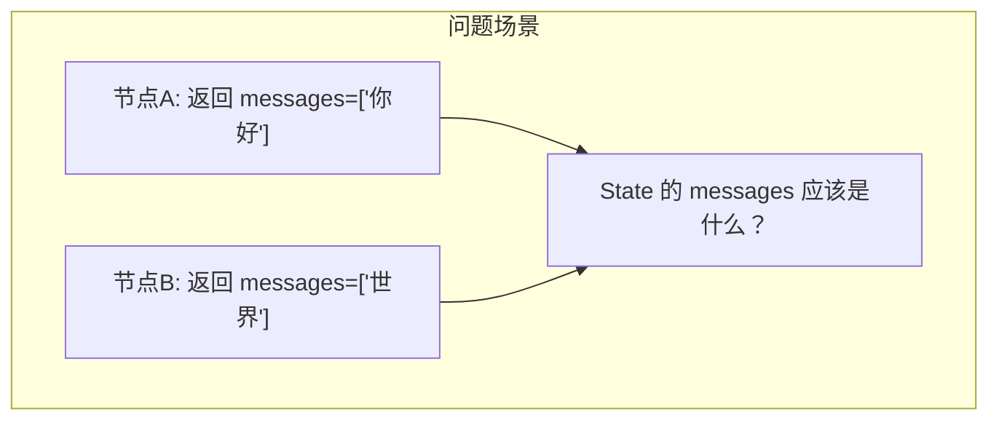
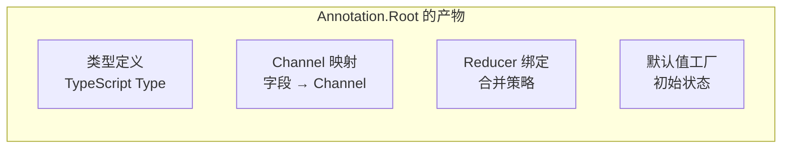
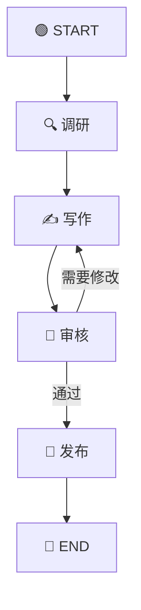
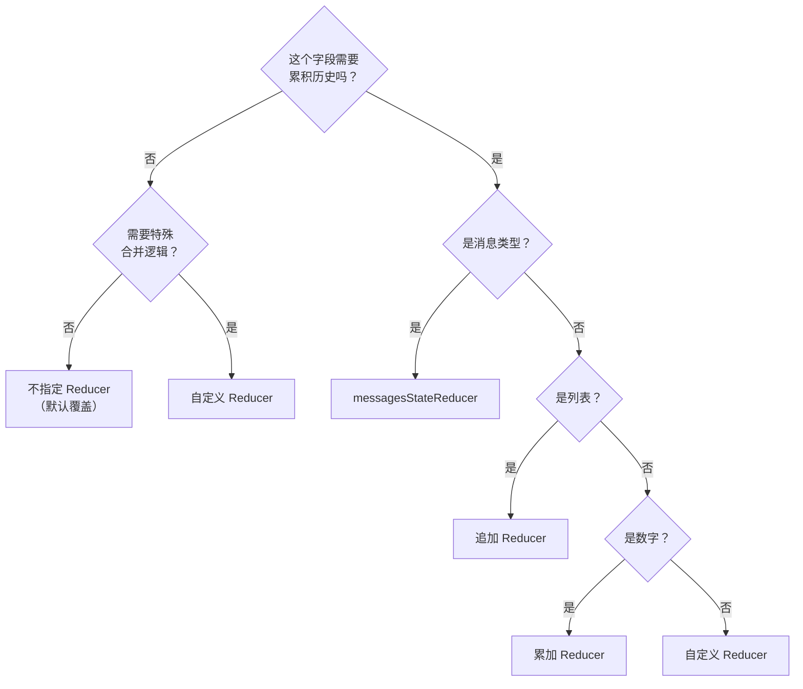

# 📦 第四章：状态管理深入

> 本章将深入讲解 LangGraph 的状态管理机制，包括 Annotation 的定义方式、Reducer 的工作原理、以及各种状态模式的最佳实践。

---

## 🎯 本章目标

- 理解 Annotation 的设计原理
- 掌握各种 Reducer 模式
- 学会处理复杂状态场景
- 理解状态的类型推导机制

---

## 📖 状态管理的核心问题

在一个多步骤的工作流中，每个步骤（节点）都可能：
- 📥 **读取**之前步骤的产出
- 📤 **写入**新的数据
- 🔄 **修改**已有的数据

核心问题是：**当多个节点更新同一个字段时，如何合并这些更新？**



答案取决于你的**业务需求**：
- 聊天记录：应该**追加** → `['你好', '世界']`
- 当前状态：应该**覆盖** → `['世界']`
- 计数器：应该**累加**
- 标签：应该**去重合并**

这就是 **Reducer** 的作用。

---

## 1️⃣ Annotation 详解

### 基本语法

```typescript
import { Annotation } from "@langchain/langgraph";

const MyState = Annotation.Root({
  // 形式一：简单类型（默认 LastValue 策略，后写覆盖先写）
  name: Annotation<string>,

  // 形式二：带 Reducer 和默认值
  messages: Annotation<string[]>({
    reducer: (existing, incoming) => [...existing, ...incoming],
    default: () => [],
  }),
});
```

### Annotation.Root 做了什么？

`Annotation.Root` 的作用是：

1. **定义类型**：TypeScript 会自动推导出状态的类型
2. **创建 Channel**：每个字段对应一个内部的 Channel
3. **绑定 Reducer**：指定每个字段的合并策略
4. **设置默认值**：初始化时的默认状态



### 类型推导

Annotation 提供了完整的类型安全支持：

```typescript
const MyState = Annotation.Root({
  name: Annotation<string>,
  count: Annotation<number>({
    reducer: (a, b) => a + b,
    default: () => 0,
  }),
  tags: Annotation<string[]>({
    reducer: (a, b) => [...a, ...b],
    default: () => [],
  }),
});

// ✅ TypeScript 自动推导类型
type StateType = typeof MyState.State;
// 等价于：
// {
//   name: string;
//   count: number;
//   tags: string[];
// }

// ✅ 在节点函数中使用
const myNode = async (state: typeof MyState.State) => {
  // state.name  → string ✅
  // state.count → number ✅
  // state.tags  → string[] ✅

  return { count: 1 }; // ✅ 类型安全
};
```

---

## 2️⃣ Reducer 模式大全

### 模式一：覆盖（LastValue）—— 默认行为

不指定 Reducer 时，新值直接覆盖旧值。

```typescript
const State = Annotation.Root({
  currentStep: Annotation<string>,  // 最后写入的值生效
});
```

**工作原理**：

```
时刻1: 节点A 写入 currentStep = "清洗" → State: { currentStep: "清洗" }
时刻2: 节点B 写入 currentStep = "分析" → State: { currentStep: "分析" }  ← 覆盖了
```

**适用场景**：当前状态、最新结果、配置项

---

### 模式二：追加（Append）

新值追加到列表末尾。

```typescript
const State = Annotation.Root({
  messages: Annotation<string[]>({
    reducer: (existing, incoming) => [...existing, ...incoming],
    default: () => [],
  }),
});
```

**工作原理**：

```
初始:    messages = []
节点A:  返回 { messages: ["你好"] }   → messages = ["你好"]
节点B:  返回 { messages: ["世界"] }   → messages = ["你好", "世界"]
```

**适用场景**：聊天记录、操作日志、事件列表

> 💡 **这是 LangGraph 最常用的 Reducer 模式**，因为 AI Agent 的核心就是不断累积消息。

---

### 模式三：累加（Sum）

数值相加。

```typescript
const State = Annotation.Root({
  totalCost: Annotation<number>({
    reducer: (current, addition) => current + addition,
    default: () => 0,
  }),
});
```

**工作原理**：

```
初始:    totalCost = 0
节点A:  返回 { totalCost: 100 }  → totalCost = 100
节点B:  返回 { totalCost: 50 }   → totalCost = 150
```

**适用场景**：费用累计、分数统计、计数器

---

### 模式四：合并对象（Merge）

浅合并两个对象。

```typescript
const State = Annotation.Root({
  metadata: Annotation<Record<string, unknown>>({
    reducer: (existing, incoming) => ({ ...existing, ...incoming }),
    default: () => ({}),
  }),
});
```

**工作原理**：

```
初始:    metadata = {}
节点A:  返回 { metadata: { author: "Alice" } }        → { author: "Alice" }
节点B:  返回 { metadata: { version: 2, ready: true } } → { author: "Alice", version: 2, ready: true }
```

**适用场景**：配置、元数据、属性收集

---

### 模式五：去重追加（Unique Append）

追加但自动去重。

```typescript
const State = Annotation.Root({
  tags: Annotation<string[]>({
    reducer: (existing, incoming) => [
      ...new Set([...existing, ...incoming]),
    ],
    default: () => [],
  }),
});
```

**工作原理**：

```
初始:    tags = []
节点A:  返回 { tags: ["AI", "NLP"] }     → ["AI", "NLP"]
节点B:  返回 { tags: ["NLP", "Agent"] }  → ["AI", "NLP", "Agent"]  ← "NLP" 没有重复
```

---

### 模式六：消息智能合并

这是 LangGraph 为聊天应用提供的特殊模式，支持消息的添加、替换和删除。

```typescript
import { Annotation, messagesStateReducer } from "@langchain/langgraph";
import { BaseMessage } from "@langchain/core/messages";

const ChatState = Annotation.Root({
  messages: Annotation<BaseMessage[]>({
    reducer: messagesStateReducer,
    default: () => [],
  }),
});
```

> 💡 `messagesStateReducer` 是 LangGraph 内置的消息 Reducer，它能根据消息的 ID 智能合并——如果 ID 相同则更新，否则追加。

---

## 3️⃣ 实战示例：多字段状态管理

### 场景：文章生成工作流



```typescript
import { StateGraph, Annotation, START, END } from "@langchain/langgraph";

// 定义状态 —— 每个字段根据业务需求选择不同的 Reducer
const ArticleState = Annotation.Root({
  // 文章主题（一旦确定就不变）
  topic: Annotation<string>,

  // 调研资料（追加收集）
  references: Annotation<string[]>({
    reducer: (existing, incoming) => [...existing, ...incoming],
    default: () => [],
  }),

  // 文章内容（覆盖：每次修改替换全文）
  content: Annotation<string>,

  // 修改次数（累加计数）
  revisionCount: Annotation<number>({
    reducer: (current, update) => current + update,
    default: () => 0,
  }),

  // 审核意见（追加记录）
  reviewComments: Annotation<string[]>({
    reducer: (existing, incoming) => [...existing, ...incoming],
    default: () => [],
  }),

  // 当前状态（覆盖：最新状态）
  phase: Annotation<string>,
});

// 调研节点
const research = async (state: typeof ArticleState.State) => {
  console.log(`🔍 正在调研主题: ${state.topic}`);
  return {
    references: [
      `参考文献1: 关于${state.topic}的综述`,
      `参考文献2: ${state.topic}最新进展`,
    ],
    phase: "researched",
  };
};

// 写作节点
const write = async (state: typeof ArticleState.State) => {
  const refs = state.references.join("; ");
  const revision = state.revisionCount;
  const comments = state.reviewComments;

  let content: string;
  if (revision === 0) {
    content = `# ${state.topic}\n\n基于 ${state.references.length} 篇参考文献的初稿。\n参考: ${refs}`;
  } else {
    content = `# ${state.topic}（第${revision + 1}版）\n\n根据审核意见修改: ${comments.at(-1)}\n参考: ${refs}`;
  }

  console.log(`✍️ 写作完成（第 ${revision + 1} 版）`);
  return {
    content,
    revisionCount: 1,
    phase: "written",
  };
};

// 审核节点
const review = async (state: typeof ArticleState.State) => {
  const needsRevision = state.revisionCount < 2; // 模拟：前两次都要求修改
  const comment = needsRevision
    ? `第${state.revisionCount}版需要补充更多细节`
    : "文章质量达标，通过审核";

  console.log(`📝 审核意见: ${comment}`);
  return {
    reviewComments: [comment],
    phase: needsRevision ? "needs_revision" : "approved",
  };
};

// 发布节点
const publish = async (state: typeof ArticleState.State) => {
  console.log(`📢 发布文章: ${state.topic}`);
  return { phase: "published" };
};

// 路由：根据审核结果决定下一步
const reviewRouter = (state: typeof ArticleState.State): string => {
  return state.phase === "approved" ? "publish" : "write";
};

// 构建图
const articleGraph = new StateGraph(ArticleState)
  .addNode("research", research)
  .addNode("write", write)
  .addNode("review", review)
  .addNode("publish", publish)
  .addEdge(START, "research")
  .addEdge("research", "write")
  .addEdge("write", "review")
  .addConditionalEdges("review", reviewRouter, {
    write: "write",
    publish: "publish",
  })
  .addEdge("publish", END);

const app = articleGraph.compile();

// 执行
const result = await app.invoke({ topic: "AI Agent 技术" });
console.log("\n=== 最终状态 ===");
console.log("主题:", result.topic);
console.log("修改次数:", result.revisionCount);
console.log("审核意见:", result.reviewComments);
console.log("当前阶段:", result.phase);
```

**执行结果**：

```
🔍 正在调研主题: AI Agent 技术
✍️ 写作完成（第 1 版）
📝 审核意见: 第1版需要补充更多细节
✍️ 写作完成（第 2 版）
📝 审核意见: 文章质量达标，通过审核
📢 发布文章: AI Agent 技术

=== 最终状态 ===
主题: AI Agent 技术
修改次数: 2
审核意见: [ '第1版需要补充更多细节', '文章质量达标，通过审核' ]
当前阶段: published
```

**注意 Reducer 的效果**：
- `revisionCount` 从 0 累加到 2（每次 +1）
- `reviewComments` 追加了两条评论
- `content` 被覆盖为最新版本
- `phase` 被覆盖为当前阶段

---

## 4️⃣ 状态的输入类型 vs 输出类型

在某些场景下，你可能希望**输入给图的类型**和**节点更新的类型**不同。

### 典型场景

```typescript
// 消息字段：
// - 节点返回 BaseMessage[]（追加多条消息）
// - 图的输入可以是 BaseMessage[]
// - 但内部状态类型是 BaseMessage[]
// Reducer 处理了这种差异
```

Annotation 的类型参数可以只有一个参数：

```typescript
// 单类型参数：输入类型 = 状态类型
Annotation<string>

// Reducer 的参数类型决定了输入方式
Annotation<number>({
  reducer: (current: number, update: number) => current + update,
  //                                 ↑ 输入类型：number
  default: () => 0,
})
```

---

## 5️⃣ 私有状态（节点间不共享的状态）

有时候，你只想让某些数据在**特定的边**上传递，而不是全局共享。

### 使用方式

可以通过定义图的 `input` 和 `output` schema 来实现：

```typescript
const OverallState = Annotation.Root({
  userInput: Annotation<string>,
  finalOutput: Annotation<string>,
});

const InternalState = Annotation.Root({
  userInput: Annotation<string>,
  finalOutput: Annotation<string>,
  // 这些字段只在内部使用
  intermediateResult: Annotation<string>,
  debugInfo: Annotation<string>,
});
```

> 💡 **为什么需要私有状态？**
> - 减少不必要的数据传递
> - 保护内部实现细节
> - 优化检查点大小

---

## 📝 本章小结

| 概念 | 说明 |
|------|------|
| **Annotation.Root** | 定义状态的结构和类型 |
| **Reducer** | 定义字段的合并策略 |
| **默认 Reducer** | 无 Reducer = LastValue（覆盖） |
| **追加 Reducer** | `(a, b) => [...a, ...b]` |
| **累加 Reducer** | `(a, b) => a + b` |
| **messagesStateReducer** | 消息智能合并（内置） |

### 🧠 选择 Reducer 的决策树



---

## 🎬 下一步

掌握了状态管理后，让我们学习更强大的路由机制——条件边和智能路由：

👉 [第五章：条件边与智能路由](./05-conditional-edges.md)

---

[← 上一章](./03-quick-start.md) | [📖 返回目录](./README.md) | [下一章 →](./05-conditional-edges.md)
