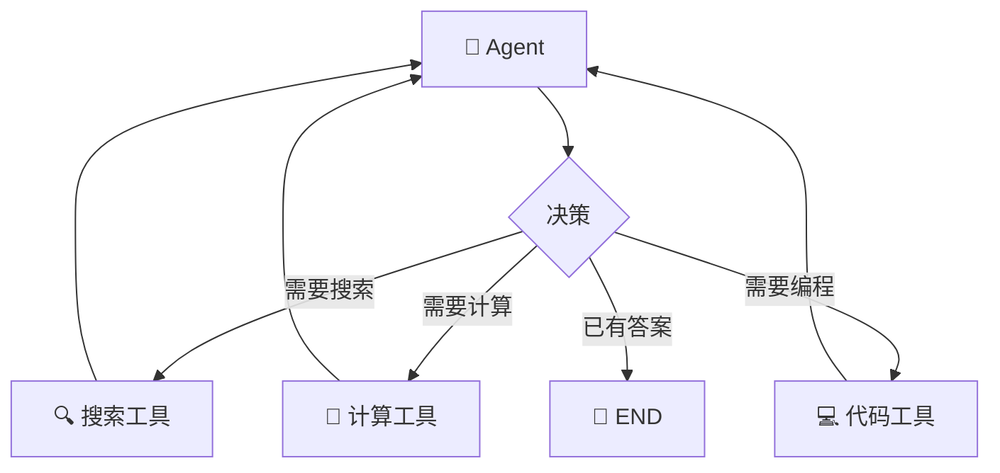
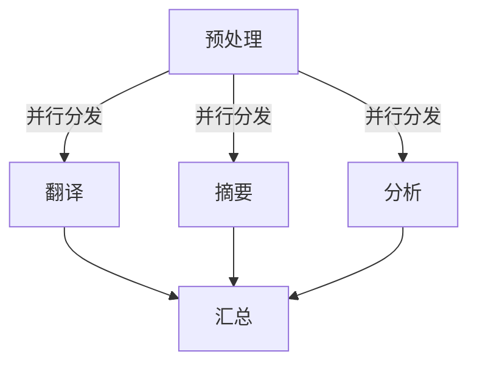
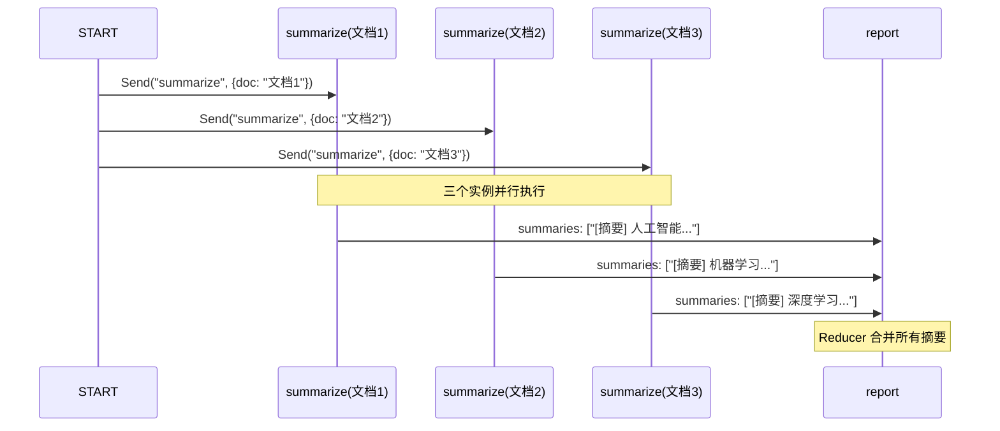
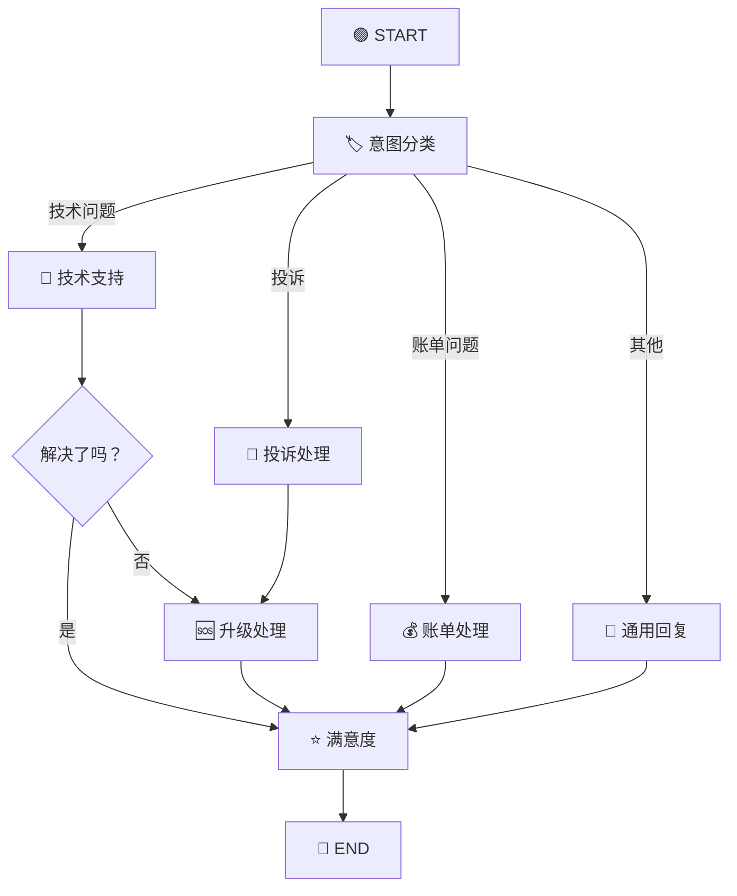
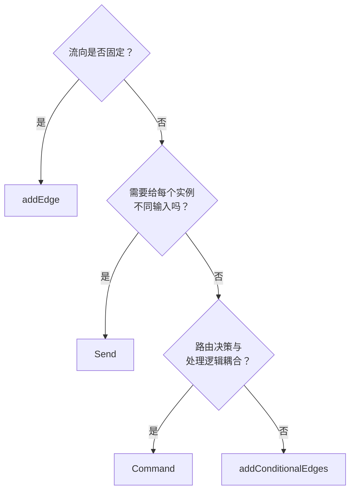

# 🔀 第五章：条件边与智能路由

> 本章将深入讲解 LangGraph 的路由机制，包括条件边、Send 动态分发和 Command 控制流。

---

## 🎯 本章目标

- 掌握条件边的各种使用方式
- 理解 Send 的动态分发机制
- 学会使用 Command 进行复杂控制流
- 能够设计复杂的路由策略

---

## 📖 为什么需要智能路由？

在现实的 AI 应用中，流程很少是线性的。我们经常需要：

- 🔀 **根据结果选择不同路径**：LLM 判断需不需要调用工具
- 🔁 **循环直到满意**：反复优化直到结果达标
- 📤 **并行分发任务**：同时处理多个子任务
- ⏹️ **提前终止**：满足条件时直接结束



---

## 1️⃣ 条件边（Conditional Edges）

### 基本语法

```typescript
graph.addConditionalEdges(
  source,     // 源节点名
  routerFn,   // 路由函数
  pathMap?     // 可选：路由映射
);
```

### 方式一：返回节点名

最简单的方式——路由函数直接返回目标节点名：

```typescript
const router = (state: typeof MyState.State): string => {
  if (state.needsTool) {
    return "tool_node";    // 去工具节点
  }
  return "__end__";         // 结束
};

graph.addConditionalEdges("agent", router);
```

### 方式二：使用 pathMap 映射

当路由函数返回的值与节点名不同时，使用 pathMap 映射：

```typescript
const router = (state: typeof MyState.State): string => {
  if (state.score > 80) return "pass";
  if (state.score > 60) return "review";
  return "fail";
};

graph.addConditionalEdges("evaluate", router, {
  pass: "publish_node",      // "pass" → publish_node
  review: "review_node",     // "review" → review_node
  fail: "rewrite_node",      // "fail" → rewrite_node
});
```

> 🤔 **为什么需要 pathMap？**
>
> - 解耦路由逻辑和节点命名
> - 路由函数可以返回有语义的字符串（如 "pass"），而不是底层节点名
> - 便于重构（改节点名不影响路由逻辑）

### 方式三：返回多个目标（并行执行）

路由函数可以返回**数组**，让多个节点**同时执行**：

```typescript
const parallelRouter = (state: typeof MyState.State): string[] => {
  const targets: string[] = [];

  if (state.needsTranslation) targets.push("translate");
  if (state.needsSummary) targets.push("summarize");
  if (state.needsAnalysis) targets.push("analyze");

  return targets;  // 返回数组 → 多个节点并行执行
};

graph.addConditionalEdges("preprocess", parallelRouter);
```



---

## 2️⃣ Send —— 动态分发

### 问题场景

有时候你不仅要决定**去哪个节点**，还要为每次执行提供**不同的输入**。

比如 Map-Reduce 模式：

```
输入: ["文档A", "文档B", "文档C"]
      ↓ 分发
处理文档A   处理文档B   处理文档C   （并行，各自有不同输入）
      ↓         ↓         ↓
      └─────── 汇总 ──────┘
```

普通的条件边做不到这一点——它只能路由到节点，但不能给每个实例传递不同的数据。

### Send 的作用

`Send` 可以将**数据连同目标节点一起发送**：

```typescript
import { Send } from "@langchain/langgraph";

// Send 的构造函数
new Send(
  "target_node",    // 目标节点名
  { key: "value" }  // 要传递的状态
);
```

### 实战示例：并行文档分析

```typescript
import { StateGraph, Annotation, START, END, Send } from "@langchain/langgraph";

// 总体状态
const MainState = Annotation.Root({
  documents: Annotation<string[]>,
  summaries: Annotation<string[]>({
    reducer: (existing, incoming) => [...existing, ...incoming],
    default: () => [],
  }),
  finalReport: Annotation<string>,
});

// 分发节点：为每个文档创建一个 Send
const distributeDocuments = (state: typeof MainState.State) => {
  // 返回 Send 数组 → 每个文档都会独立执行 summarize 节点
  return state.documents.map(
    (doc) => new Send("summarize", { documents: [doc], summaries: [] })
  );
};

// 摘要节点：处理单个文档
const summarize = async (state: typeof MainState.State) => {
  const doc = state.documents[0]; // 每次只收到一个文档
  const summary = `[摘要] ${doc.substring(0, 20)}...`; // 模拟摘要生成
  console.log(`📝 生成摘要: ${summary}`);
  return { summaries: [summary] };
};

// 汇总节点
const generateReport = async (state: typeof MainState.State) => {
  return {
    finalReport: `共分析 ${state.summaries.length} 篇文档:\n${state.summaries.join("\n")}`,
  };
};

// 构建图
const graph = new StateGraph(MainState)
  .addNode("summarize", summarize)
  .addNode("report", generateReport)
  .addConditionalEdges(START, distributeDocuments)
  .addEdge("summarize", "report")
  .addEdge("report", END);

const app = graph.compile();

const result = await app.invoke({
  documents: [
    "人工智能的发展历史可以追溯到1950年代...",
    "机器学习是人工智能的核心技术之一...",
    "深度学习在图像识别领域取得了突破性进展...",
  ],
});

console.log(result.finalReport);
```

**执行流程**：



---

## 3️⃣ Command —— 状态更新 + 路由一体化

### 问题场景

有时候，一个节点既要**更新状态**，又要**决定下一步**。使用普通的返回值 + 条件边需要两步操作。`Command` 让你在**一个返回值里同时做两件事**。

### Command 的作用

```typescript
import { Command } from "@langchain/langgraph";

// Command 可以同时指定：
// 1. 状态更新（update）
// 2. 下一步去哪（goto）
return new Command({
  update: { count: 1 },       // 更新状态
  goto: "next_node",           // 路由到下一个节点
});
```

### 实战示例：审批流程

```typescript
import { StateGraph, Annotation, START, END, Command } from "@langchain/langgraph";

const ApprovalState = Annotation.Root({
  request: Annotation<string>,
  amount: Annotation<number>,
  approvals: Annotation<string[]>({
    reducer: (existing, incoming) => [...existing, ...incoming],
    default: () => [],
  }),
  status: Annotation<string>,
});

// 初审节点：使用 Command 同时更新状态和路由
const firstReview = async (state: typeof ApprovalState.State) => {
  console.log(`📋 初审: ${state.request}, 金额: ¥${state.amount}`);

  if (state.amount > 10000) {
    // 大额：需要复审，同时记录初审通过
    return new Command({
      update: {
        approvals: ["初审通过（大额需复审）"],
        status: "pending_second_review",
      },
      goto: "second_review",  // 路由到复审
    });
  }

  // 小额：直接通过
  return new Command({
    update: {
      approvals: ["初审通过"],
      status: "approved",
    },
    goto: "notify",  // 直接通知
  });
};

// 复审节点
const secondReview = async (state: typeof ApprovalState.State) => {
  console.log(`👔 复审: 金额 ¥${state.amount}`);
  return new Command({
    update: {
      approvals: ["复审通过"],
      status: "approved",
    },
    goto: "notify",
  });
};

// 通知节点
const notify = async (state: typeof ApprovalState.State) => {
  console.log(`📧 通知: ${state.status}`);
  return { status: "notified" };
};

const graph = new StateGraph(ApprovalState)
  .addNode("first_review", firstReview)
  .addNode("second_review", secondReview)
  .addNode("notify", notify)
  .addEdge(START, "first_review")
  // 注意：使用 Command 后，不需要从 first_review 出发的条件边
  // Command 内部的 goto 已经处理了路由
  .addEdge("notify", END);

const app = graph.compile();

// 测试大额请求
const result = await app.invoke({
  request: "购买服务器",
  amount: 50000,
});
console.log("审批记录:", result.approvals);
// ["初审通过（大额需复审）", "复审通过"]
```

### Command vs 条件边的对比

| 特性 | 条件边 | Command |
|------|--------|---------|
| 路由决策 | 单独的路由函数 | 在节点函数内部 |
| 状态更新 | 节点返回值 | Command.update |
| 代码位置 | 分散（节点 + 路由函数） | 集中（一个 Command） |
| 适用场景 | 路由逻辑与处理逻辑独立 | 路由决策依赖处理结果 |
| 多目标 | 返回数组 | goto 支持数组 |

> 💡 **建议**：当路由决策与节点处理紧密相关时，使用 `Command`；当路由逻辑独立时，使用条件边。

---

## 4️⃣ 综合实战：智能客服路由



```typescript
import { StateGraph, Annotation, START, END, Command } from "@langchain/langgraph";

const ServiceState = Annotation.Root({
  userMessage: Annotation<string>,
  category: Annotation<string>,
  response: Annotation<string>,
  resolved: Annotation<boolean>,
  logs: Annotation<string[]>({
    reducer: (a, b) => [...a, ...b],
    default: () => [],
  }),
  satisfaction: Annotation<number>,
});

// 意图分类节点
const classify = async (state: typeof ServiceState.State) => {
  const msg = state.userMessage.toLowerCase();

  let category: string;
  if (msg.includes("bug") || msg.includes("错误") || msg.includes("技术")) {
    category = "tech";
  } else if (msg.includes("账单") || msg.includes("付款") || msg.includes("费用")) {
    category = "billing";
  } else if (msg.includes("投诉") || msg.includes("不满") || msg.includes("差评")) {
    category = "complaint";
  } else {
    category = "general";
  }

  // 使用 Command 同时更新状态和路由
  return new Command({
    update: {
      category,
      logs: [`🏷️ 分类为: ${category}`],
    },
    goto: category,  // 路由到对应的处理节点
  });
};

// 技术支持
const techSupport = async (state: typeof ServiceState.State) => {
  const resolved = !state.userMessage.includes("严重");  // 模拟判断
  return {
    response: "技术团队已分析您的问题...",
    resolved,
    logs: [`🔧 技术处理, 已解决: ${resolved}`],
  };
};

// 路由：根据是否解决决定下一步
const techRouter = (state: typeof ServiceState.State): string => {
  return state.resolved ? "feedback" : "escalate";
};

// 账单处理
const billingSupport = async (state: typeof ServiceState.State) => {
  return {
    response: "账单问题已处理...",
    resolved: true,
    logs: ["💰 账单已处理"],
  };
};

// 投诉处理 → 直接升级
const complaintHandler = async (state: typeof ServiceState.State) => {
  return {
    response: "非常抱歉给您带来不好的体验...",
    logs: ["😤 投诉已记录"],
  };
};

// 通用回复
const generalHandler = async (state: typeof ServiceState.State) => {
  return {
    response: "感谢您的咨询...",
    resolved: true,
    logs: ["💬 通用回复"],
  };
};

// 升级处理
const escalate = async (state: typeof ServiceState.State) => {
  return {
    response: "问题已升级至高级工程师...",
    resolved: true,
    logs: ["🆘 已升级处理"],
  };
};

// 满意度收集
const feedback = async (state: typeof ServiceState.State) => {
  const satisfaction = state.resolved ? 4 : 2;
  return {
    satisfaction,
    logs: [`⭐ 满意度: ${satisfaction}/5`],
  };
};

// 构建图
const graph = new StateGraph(ServiceState)
  .addNode("classify", classify)
  .addNode("tech", techSupport)
  .addNode("billing", billingSupport)
  .addNode("complaint", complaintHandler)
  .addNode("general", generalHandler)
  .addNode("escalate", escalate)
  .addNode("feedback", feedback)
  .addEdge(START, "classify")
  // classify 使用 Command 内部路由，无需条件边
  .addConditionalEdges("tech", techRouter, {
    feedback: "feedback",
    escalate: "escalate",
  })
  .addEdge("billing", "feedback")
  .addEdge("complaint", "escalate")
  .addEdge("general", "feedback")
  .addEdge("escalate", "feedback")
  .addEdge("feedback", END);

const app = graph.compile();

// 测试
const result = await app.invoke({
  userMessage: "我的程序有一个技术bug，但不严重",
});
console.log("处理日志:", result.logs);
console.log("满意度:", result.satisfaction);
```

---

## 📝 本章小结

| 路由方式 | 适用场景 | 关键特点 |
|---------|---------|---------|
| **addEdge** | 固定流向 | 最简单，A→B |
| **addConditionalEdges** | 动态分支 | 根据状态选路 |
| **Send** | Map-Reduce | 不同输入并行 |
| **Command** | 更新+路由一体 | 节点内部控制流 |

### 🧠 选择路由方式的决策树



---

## 🎬 下一步

理解了路由机制后，让我们深入了解 LangGraph 的底层通信机制——Channel：

👉 [第六章：Channel 通信机制](./06-channels.md)

---

[← 上一章](./04-state-management.md) | [📖 返回目录](./README.md) | [下一章 →](./06-channels.md)
