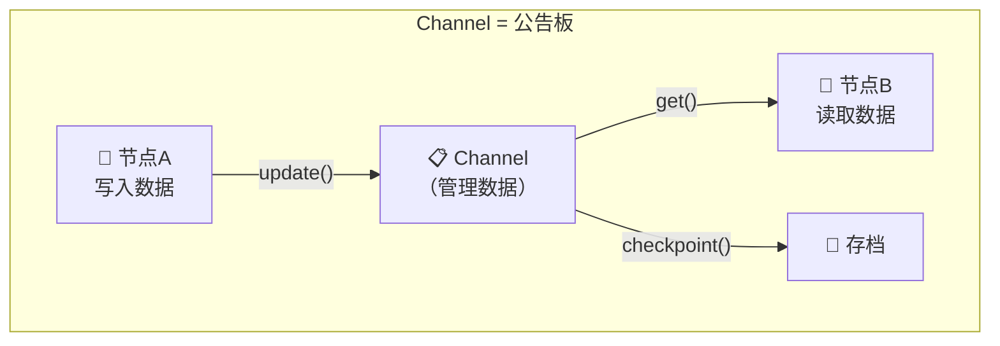
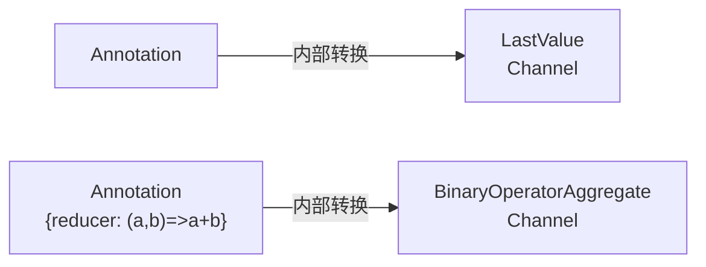
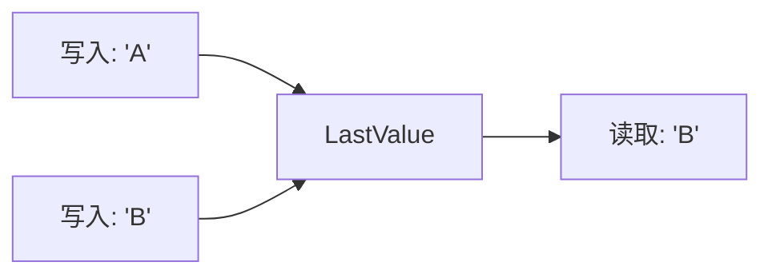
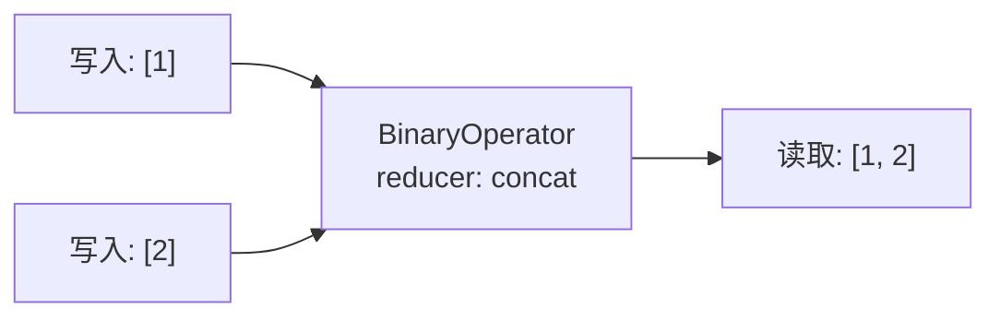
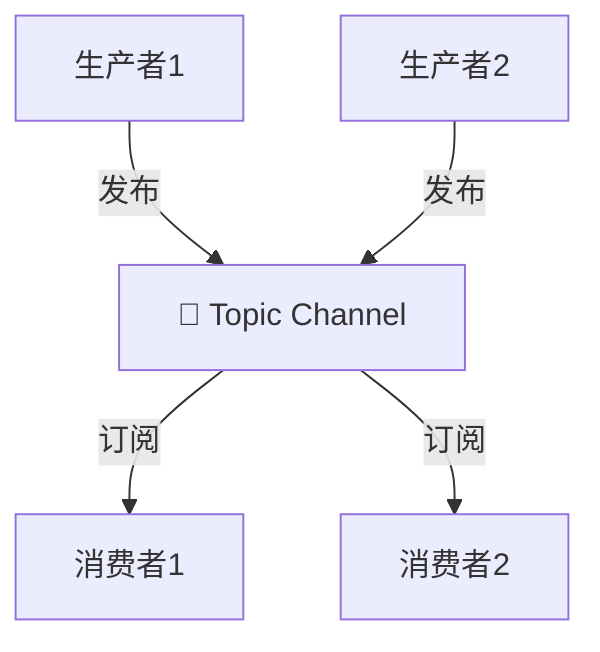
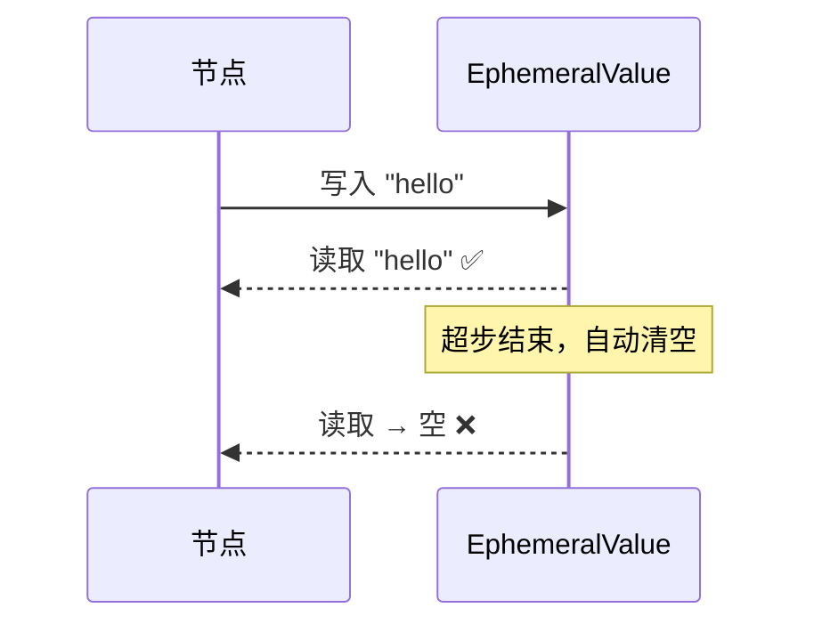
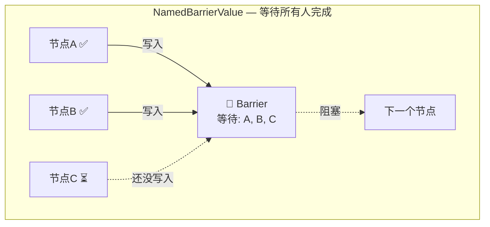
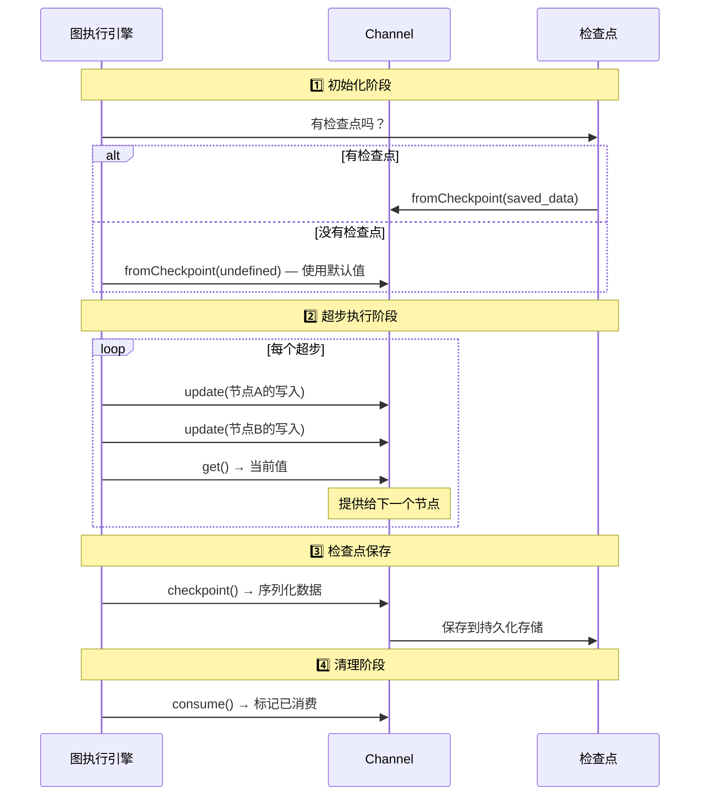
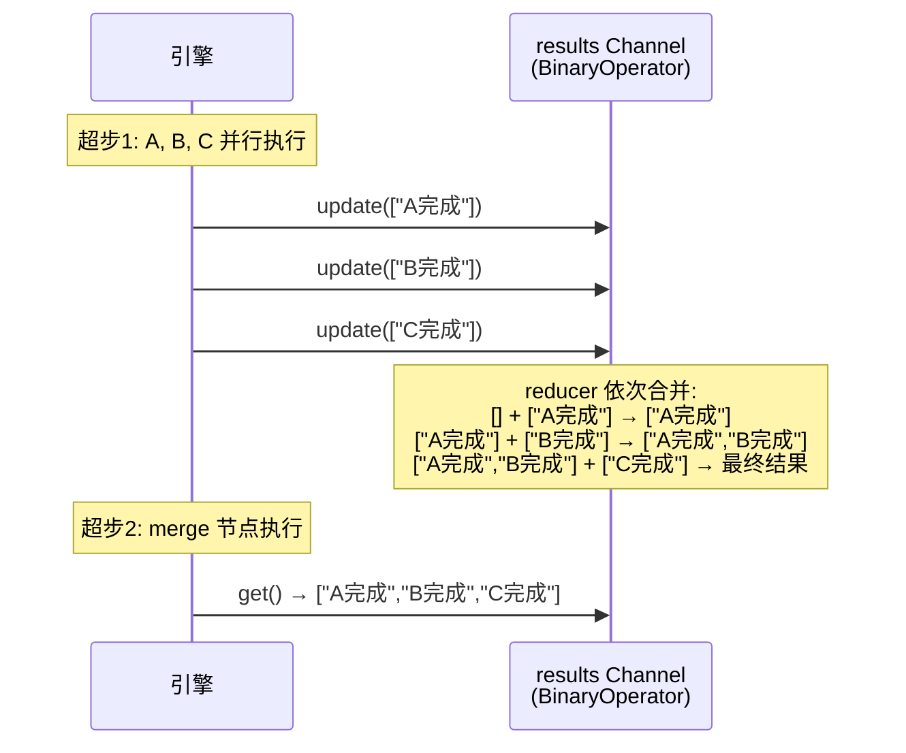

# 📡 第六章：Channel 通信机制详解

> 本章将深入讲解 LangGraph 的底层通信机制——Channel。理解 Channel 有助于你理解 LangGraph 的工作原理，并在需要时做更精细的控制。

---

## 🎯 本章目标

- 理解 Channel 的设计理念
- 掌握不同类型 Channel 的特点和使用场景
- 理解 Channel 与 Annotation 的关系
- 学会在高级场景中使用 Channel

---

## 📖 Channel 是什么？

### 生活类比

把 LangGraph 想象成一个**办公楼**：

| 概念 | 类比 |
|------|------|
| **节点（Node）** | 办公室里的员工 |
| **Channel** | 员工之间的**公告板/收件箱** |
| **State** | 公告板上的**所有信息汇总** |

每个 Channel 就是一个独立的"公告板"：
- 员工（节点）可以在上面**贴信息**（写入）
- 其他员工可以**查看信息**（读取）
- 公告板有**不同的规则**决定信息如何管理



### Channel 的核心接口

每个 Channel 都实现了以下操作：

```typescript
abstract class BaseChannel<Value, Update, Checkpoint> {
  // 写入更新
  abstract update(values: Update[]): boolean;

  // 读取当前值
  abstract get(): Value;

  // 创建检查点（序列化）
  abstract checkpoint(): Checkpoint;

  // 从检查点恢复
  abstract fromCheckpoint(checkpoint?: Checkpoint): this;

  // 标记已消费（用于某些 Channel 类型）
  abstract consume(): boolean;
}
```

---

## 🧩 Channel 与 Annotation 的关系

你在前面章节学到的 `Annotation` 实际上是 Channel 的**语法糖**：



| Annotation 定义 | 对应的 Channel |
|-----------------|---------------|
| `Annotation<T>` （无 Reducer） | `LastValue<T>` |
| `Annotation<T>({ reducer, default })` | `BinaryOperatorAggregate<T>` |

**你不需要直接操作 Channel**——Annotation 已经帮你处理好了。但理解 Channel 有助于：
1. 理解底层原理
2. 调试复杂问题
3. 使用高级 Channel 类型

---

## 📦 Channel 类型详解

### 1. LastValue Channel

**行为**：只保留最后一个写入的值。



**特点**：
- 如果同一个"超步"中有多个节点写入，会**报错**（只允许一个写入者）
- 最简单的 Channel 类型
- 当你用 `Annotation<T>` 不指定 Reducer 时，就是这个

**对应源码**（简化版）：

```typescript
class LastValue<T> extends BaseChannel<T, T, T> {
  value: T | undefined;

  update(values: T[]): boolean {
    if (values.length > 1) {
      throw new Error("LastValue 只允许一个写入者！");
    }
    if (values.length === 1) {
      this.value = values[0];
      return true;
    }
    return false;
  }

  get(): T {
    if (this.value === undefined) {
      throw new EmptyChannelError();
    }
    return this.value;
  }
}
```

**适用场景**：当前状态、最新结果、配置项等只需要"最新值"的字段。

---

### 2. BinaryOperatorAggregate Channel

**行为**：使用 Reducer 函数合并多个写入值。



**特点**：
- 支持多个节点同时写入
- 按顺序应用 Reducer
- 支持默认值

**对应源码**（简化版）：

```typescript
class BinaryOperatorAggregate<T> extends BaseChannel<T, T, T> {
  value: T;
  reducer: (left: T, right: T) => T;

  update(values: T[]): boolean {
    let updated = false;
    for (const value of values) {
      this.value = this.reducer(this.value, value);
      updated = true;
    }
    return updated;
  }

  get(): T {
    return this.value;
  }
}
```

**适用场景**：消息列表、计数器、需要累积的任何字段。

---

### 3. Topic Channel

**行为**：发布/订阅模式，支持多个生产者和消费者。



**特点**：
- 值在每个超步后会被**清空**（临时性）
- 适合事件驱动的场景
- 多个生产者可以同时发布

**适用场景**：事件通知、一次性消息传递。

---

### 4. EphemeralValue Channel

**行为**：临时值，在每个超步后自动清空。



**特点**：
- 值只在当前超步有效
- 不会被持久化到检查点
- 适合临时的中间状态

**适用场景**：临时计算结果、一次性标记。

---

### 5. NamedBarrierValue Channel

**行为**：等待**所有指定的节点**都写入后，才允许读取。



**特点**：
- 需要预先指定要等待的节点名列表
- 所有指定节点都写入后，才允许继续
- 用于同步并行执行的节点

**适用场景**：并行任务的同步点、汇聚操作。

---

### 6. DynamicBarrierValue Channel

**行为**：类似 NamedBarrierValue，但等待的节点列表是**动态**确定的。

**特点**：
- 等待列表在运行时确定
- 更灵活，适合不确定有多少并行任务的场景

**适用场景**：动态并行（如 Send 产生的多个实例）。

---

### 7. AnyValue Channel

**行为**：接受任何类型的值，任何节点写入都会触发更新。

**特点**：
- 最宽松的 Channel
- 没有类型限制

---

## 🔍 Channel 的生命周期

一个 Channel 在图执行过程中经历的完整生命周期：



---

## 🧪 实际案例：理解 Channel 的工作

### 案例：三个节点并行写入

```typescript
import { StateGraph, Annotation, START, END } from "@langchain/langgraph";

const ParallelState = Annotation.Root({
  // LastValue：不能并行写入同一字段
  currentNode: Annotation<string>,

  // BinaryOperator：可以并行写入并合并
  results: Annotation<string[]>({
    reducer: (a, b) => [...a, ...b],
    default: () => [],
  }),
});

const nodeA = async () => ({ results: ["A完成"] });
const nodeB = async () => ({ results: ["B完成"] });
const nodeC = async () => ({ results: ["C完成"] });

const graph = new StateGraph(ParallelState)
  .addNode("A", nodeA)
  .addNode("B", nodeB)
  .addNode("C", nodeC)
  .addNode("merge", async (state) => ({
    currentNode: "merge",
  }))
  .addEdge(START, "A")
  .addEdge(START, "B")
  .addEdge(START, "C")
  .addEdge("A", "merge")
  .addEdge("B", "merge")
  .addEdge("C", "merge")
  .addEdge("merge", END);

const app = graph.compile();
const result = await app.invoke({});

console.log(result.results);
// ["A完成", "B完成", "C完成"]
// ↑ BinaryOperator Channel 自动合并了三个节点的写入
```

**底层发生了什么**：



---

## ⚠️ 常见陷阱

### 陷阱一：LastValue 的多写入冲突

```typescript
// ❌ 错误：两个并行节点写入同一个 LastValue 字段
const State = Annotation.Root({
  result: Annotation<string>,  // LastValue！
});

const nodeA = async () => ({ result: "A的结果" });
const nodeB = async () => ({ result: "B的结果" });

// 如果 A 和 B 在同一个超步并行执行，会报错！
// 因为 LastValue 不允许多个写入者
```

**解决方案**：使用带 Reducer 的 Annotation。

### 陷阱二：忘记设置默认值

```typescript
// ❌ 如果没有节点写入过 count，读取时会报 EmptyChannelError
const State = Annotation.Root({
  count: Annotation<number>({
    reducer: (a, b) => a + b,
    // 缺少 default!
  }),
});

// ✅ 总是设置默认值
const State2 = Annotation.Root({
  count: Annotation<number>({
    reducer: (a, b) => a + b,
    default: () => 0,  // ✅ 安全
  }),
});
```

---

## 📊 Channel 类型对比

| Channel 类型 | 多写入 | 持久化 | 默认值 | 适用场景 |
|-------------|:------:|:------:|:------:|---------|
| **LastValue** | ❌ 单写入 | ✅ | 可选 | 当前值 |
| **BinaryOperator** | ✅ 多写入 | ✅ | 可选 | 累积数据 |
| **Topic** | ✅ 多写入 | ❌ 每步清空 | 无 | 事件通知 |
| **EphemeralValue** | ❌ 单写入 | ❌ 不存档 | 无 | 临时数据 |
| **NamedBarrier** | ✅ 等待所有 | ✅ | 无 | 同步点 |
| **DynamicBarrier** | ✅ 动态等待 | ✅ | 无 | 动态同步 |
| **AnyValue** | ✅ 任意 | ✅ | 可选 | 通用存储 |

---

## 🧠 为什么这样设计？

### 1. 关注点分离

Channel 把**数据存储**和**处理逻辑**完全分开：
- 节点只关心"读什么、写什么"
- Channel 负责"怎么存、怎么合并"

### 2. 可插拔的合并策略

同样的数据，不同的 Channel 类型给出不同的行为，而节点代码不需要改变。

### 3. 支持检查点

每个 Channel 都能独立序列化和反序列化，使得检查点机制变得简单可靠。

### 4. 并行安全

Channel 的 `update` 方法被设计为可以安全处理并行写入（通过 Reducer），避免了竞态条件。

---

## 📝 本章小结

| 知识点 | 说明 |
|-------|------|
| **Channel 是什么** | 节点间通信的底层机制 |
| **Annotation 与 Channel** | Annotation 是 Channel 的语法糖 |
| **LastValue** | 只保留最新值，不允许并行写入 |
| **BinaryOperator** | 使用 Reducer 合并多个写入 |
| **Topic** | 发布/订阅，每步清空 |
| **EphemeralValue** | 临时值，不持久化 |
| **NamedBarrier** | 等待所有指定节点完成 |

---

## 🎬 下一步

了解了通信机制后，让我们学习如何让图的执行状态持久化——检查点机制：

👉 [第七章：持久化与检查点](./07-checkpointer.md)

---

[← 上一章](./05-conditional-edges.md) | [📖 返回目录](./README.md) | [下一章 →](./07-checkpointer.md)
