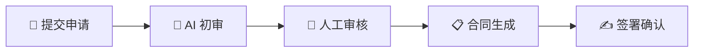
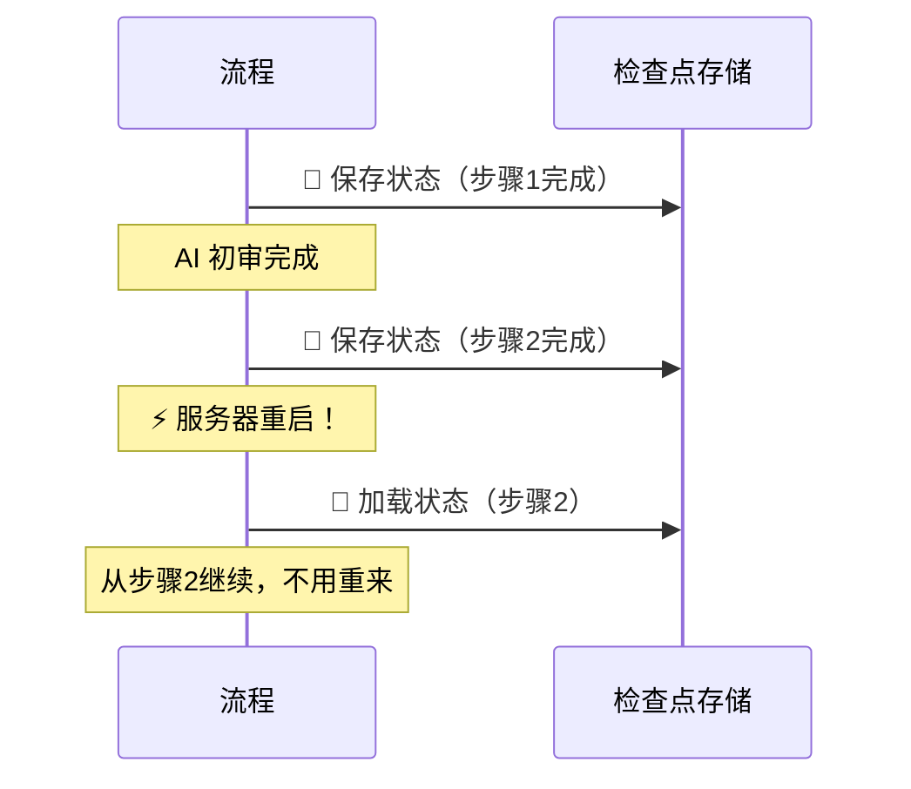
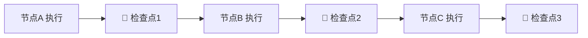
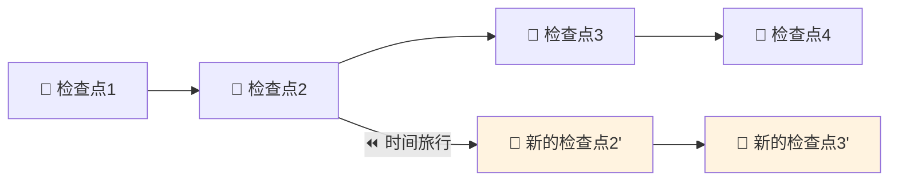
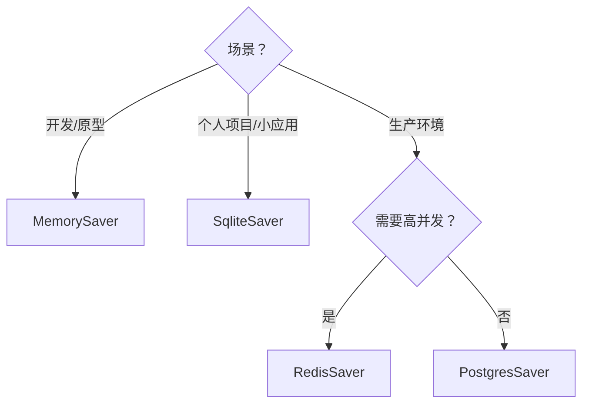
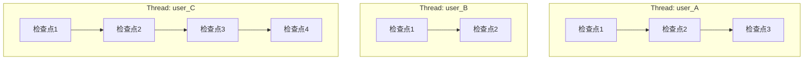

# 💾 第七章：持久化与检查点机制

> 本章将深入讲解 LangGraph 的检查点（Checkpoint）机制，包括状态持久化、恢复执行、时间旅行调试等高级功能。

---

## 🎯 本章目标

- 理解检查点的设计原理和解决的问题
- 掌握不同的检查点存储后端
- 学会恢复中断的执行
- 理解时间旅行调试

---

## 📖 为什么需要检查点？

### 现实场景

想象一个 AI 辅助的**贷款审批流程**：



这个流程可能需要**数天**才能完成：
- AI 初审可能需要几秒
- 人工审核可能需要几小时或几天
- 签署确认可能需要几天

**问题**：
1. 如果服务器重启了，流程状态丢了怎么办？
2. 人工审核员下班了，明天回来怎么继续？
3. 客户对审核结果不满意，能不能"回到"某个步骤重新来？

**答案**：检查点机制！



---

## 1️⃣ 检查点的基本概念

### 检查点是什么？

检查点就是图执行过程中某个时刻的**状态快照**。

```typescript
// 检查点的数据结构（简化版）
interface Checkpoint {
  v: number;           // 版本号
  id: string;          // 检查点唯一 ID
  ts: string;          // 时间戳（ISO 格式）
  channel_values: {    // 所有 Channel 的值
    messages: [...],
    count: 5,
    status: "processing"
  };
  channel_versions: {  // Channel 版本号（追踪变更）
    messages: "3",
    count: "2",
    status: "3"
  };
}
```

### 检查点的保存时机

LangGraph 在**每个节点执行完成后**自动保存检查点：



这意味着如果在节点B执行后崩溃，可以从**检查点2**恢复，不需要重新执行节点A。

---

## 2️⃣ 使用检查点

### 第一步：选择存储后端

```typescript
// 🟢 内存存储（开发/测试用）
import { MemorySaver } from "@langchain/langgraph";
const checkpointer = new MemorySaver();

// 🔵 SQLite 存储（轻量级持久化）
// npm install @langchain/langgraph-checkpoint-sqlite
import { SqliteSaver } from "@langchain/langgraph-checkpoint-sqlite";
const checkpointer = SqliteSaver.fromConnString("./checkpoints.db");

// 🟣 PostgreSQL 存储（生产环境推荐）
// npm install @langchain/langgraph-checkpoint-postgres
import { PostgresSaver } from "@langchain/langgraph-checkpoint-postgres";
const checkpointer = PostgresSaver.fromConnString("postgresql://...");
```

### 第二步：编译时传入检查点

```typescript
const app = graph.compile({
  checkpointer: new MemorySaver(),
});
```

### 第三步：使用 thread_id 标识会话

```typescript
// thread_id 是会话的唯一标识
// 同一个 thread_id 的执行会共享检查点
const config = {
  configurable: {
    thread_id: "user_123_session_1",
  },
};

// 第一次执行
const result1 = await app.invoke(
  { messages: [{ role: "user", content: "你好" }] },
  config
);

// 第二次执行（同一个 thread_id，会从上次的状态继续）
const result2 = await app.invoke(
  { messages: [{ role: "user", content: "继续刚才的话题" }] },
  config
);
```

### 完整示例：多轮对话

```typescript
import { StateGraph, Annotation, START, END, MemorySaver } from "@langchain/langgraph";

const ChatState = Annotation.Root({
  messages: Annotation<Array<{ role: string; content: string }>>({
    reducer: (existing, incoming) => [...existing, ...incoming],
    default: () => [],
  }),
  turnCount: Annotation<number>({
    reducer: (current, update) => current + update,
    default: () => 0,
  }),
});

const chatBot = async (state: typeof ChatState.State) => {
  const lastMessage = state.messages.at(-1);
  const reply = {
    role: "assistant",
    content: `你说了"${lastMessage?.content}"，这是第 ${state.turnCount + 1} 轮对话。`,
  };

  return {
    messages: [reply],
    turnCount: 1,
  };
};

const graph = new StateGraph(ChatState)
  .addNode("bot", chatBot)
  .addEdge(START, "bot")
  .addEdge("bot", END);

// ✅ 使用 MemorySaver 作为检查点
const app = graph.compile({
  checkpointer: new MemorySaver(),
});

const config = { configurable: { thread_id: "chat-001" } };

// 第一轮
const r1 = await app.invoke(
  { messages: [{ role: "user", content: "你好" }] },
  config
);
console.log("第1轮:", r1.messages.at(-1));
// { role: "assistant", content: '你说了"你好"，这是第 1 轮对话。' }

// 第二轮（状态自动恢复！）
const r2 = await app.invoke(
  { messages: [{ role: "user", content: "今天天气怎么样" }] },
  config
);
console.log("第2轮:", r2.messages.at(-1));
// { role: "assistant", content: '你说了"今天天气怎么样"，这是第 2 轮对话。' }

console.log("总消息数:", r2.messages.length); // 4（2轮 × 2条）
```

---

## 3️⃣ 查看和管理状态

### 获取当前状态

```typescript
const state = await app.getState(config);

console.log("当前值:", state.values);
console.log("下一步节点:", state.next);         // 如果图还在执行中
console.log("检查点 ID:", state.config?.configurable?.checkpoint_id);
console.log("元数据:", state.metadata);
```

### 查看状态历史

```typescript
// 获取所有历史检查点
const history = app.getStateHistory(config);

for await (const snapshot of history) {
  console.log("---");
  console.log("检查点:", snapshot.config?.configurable?.checkpoint_id);
  console.log("时间:", snapshot.metadata?.timestamp);
  console.log("执行节点:", snapshot.metadata?.source);
  console.log("值:", snapshot.values);
}
```

这就是**时间旅行调试**的基础——你可以看到图在每一步的状态！

### 回到历史状态

```typescript
// 获取历史状态
const history = app.getStateHistory(config);
const snapshots = [];
for await (const s of history) {
  snapshots.push(s);
}

// 选择要回到的检查点
const targetSnapshot = snapshots[2]; // 回到第3个检查点

// 从这个状态重新执行
const result = await app.invoke(
  { messages: [{ role: "user", content: "让我们从这里重来" }] },
  targetSnapshot.config  // 使用历史检查点的 config
);
```



### 手动更新状态

```typescript
// 直接修改图的状态（无需重新执行）
await app.updateState(
  config,
  {
    messages: [{ role: "system", content: "管理员插入的消息" }],
  }
);

// 查看更新后的状态
const updated = await app.getState(config);
console.log(updated.values.messages);
```

---

## 4️⃣ 检查点存储后端对比

| 后端 | 适用场景 | 持久化 | 性能 | 部署复杂度 |
|------|---------|:------:|:----:|:---------:|
| **MemorySaver** | 开发/测试 | ❌ 内存 | ⚡ 最快 | ⭐ 简单 |
| **SqliteSaver** | 小型应用 | ✅ 文件 | 🔵 快 | ⭐ 简单 |
| **PostgresSaver** | 生产环境 | ✅ 数据库 | 🟢 好 | ⭐⭐⭐ |
| **MongoDBSaver** | 文档型存储 | ✅ 数据库 | 🟢 好 | ⭐⭐⭐ |
| **RedisSaver** | 高速缓存 | ✅ 内存+持久化 | ⚡ 极快 | ⭐⭐ |

### 选择建议



---

## 5️⃣ Thread（线程）的概念

`thread_id` 是 LangGraph 中一个重要的概念：



**每个 thread_id 维护独立的检查点链**。这意味着：
- 不同用户的对话互不干扰
- 同一用户的不同会话可以有不同的 thread_id
- 每个 thread 有自己完整的状态历史

```typescript
// 用户A的会话
const configA = { configurable: { thread_id: "user_A_chat" } };
await app.invoke(input, configA);

// 用户B的会话（完全独立）
const configB = { configurable: { thread_id: "user_B_chat" } };
await app.invoke(input, configB);
```

---

## 🧠 检查点的设计原理

### 为什么每步都保存？

```
优点：
✅ 精确的故障恢复（最多丢失一个节点的计算）
✅ 支持细粒度的时间旅行
✅ 人机协作中可以在任意节点暂停
✅ 便于调试和审计

代价：
⚠️ 存储空间（但每次只保存增量）
⚠️ 写入性能（但通常不是瓶颈，AI推理更慢）
```

### 增量保存

LangGraph 不是每次都保存完整状态，而是通过 `channel_versions` 追踪哪些 Channel 发生了变化，只保存变化的部分。

---

## 📝 本章小结

| 知识点 | 说明 |
|-------|------|
| **Checkpoint** | 图执行过程中的状态快照 |
| **Checkpointer** | 检查点的存储后端 |
| **thread_id** | 会话标识，每个线程独立 |
| **getState** | 获取当前状态 |
| **getStateHistory** | 获取历史状态列表 |
| **updateState** | 手动修改状态 |
| **时间旅行** | 回到任意历史检查点重新执行 |

---

## 🎬 下一步

有了检查点机制，让我们学习另一个强大的特性——流式输出：

👉 [第八章：流式输出](./08-streaming.md)

---

[← 上一章](./06-channels.md) | [📖 返回目录](./README.md) | [下一章 →](./08-streaming.md)
