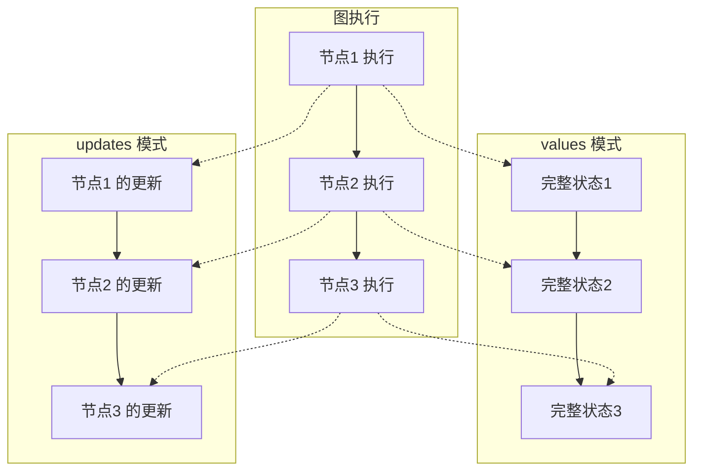
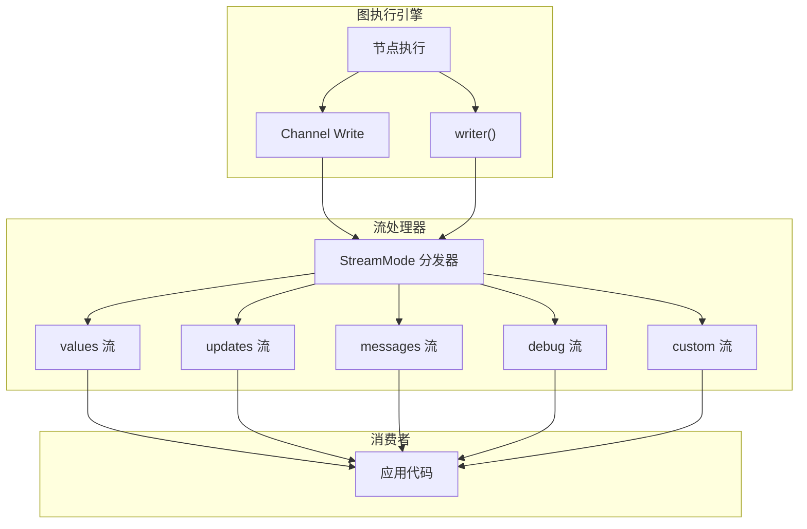
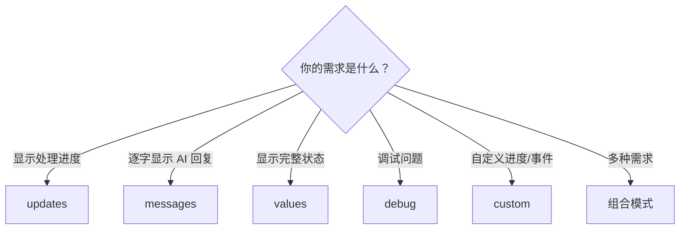

# 🌊 第八章：流式输出详解

> 本章将介绍 LangGraph 丰富的流式输出能力，让你的应用能够实时展示 AI 的处理过程。

---

## 🎯 本章目标

- 理解为什么需要流式输出
- 掌握不同 StreamMode 的使用方法
- 学会处理流式数据
- 实现实时用户界面更新

---

## 📖 为什么需要流式输出？

### 没有流式输出的用户体验

```
用户: "帮我分析这份报告"
[等待 30 秒...]
[等待 30 秒...]
[等待 30 秒...]
AI: "以下是分析结果..."  ← 用户已经等不耐烦了 😤
```

### 有流式输出的用户体验

```
用户: "帮我分析这份报告"
AI: [正在阅读报告...] (1秒)
AI: [识别到 3 个关键议题...] (3秒)
AI: [正在分析第1个议题...] (5秒)
AI: [分析完成，生成结论...] (8秒)
AI: "以下是分析结果..."  ← 用户全程有感知 😊
```

---

## 1️⃣ StreamMode 总览

LangGraph 提供了多种流式输出模式：

| StreamMode | 输出内容 | 适用场景 |
|-----------|---------|---------|
| `"values"` | 每步完成后的**完整状态** | 需要查看全局状态变化 |
| `"updates"` | 每个节点的**增量更新** | 关注每个节点做了什么 |
| `"messages"` | LLM 生成的**消息 token** | 聊天界面逐字显示 |
| `"debug"` | 详细的**调试信息** | 开发调试 |
| `"custom"` | 自定义的**写入数据** | 任意自定义 |



---

## 2️⃣ updates 模式（默认）

每个节点执行完成后，输出该节点返回的**增量更新**。

```typescript
const stream = await app.stream(
  { rawText: "Hello World" },
  { streamMode: "updates" }  // 默认值，可以省略
);

for await (const chunk of stream) {
  // chunk 格式: { 节点名: 更新内容 }
  const [[nodeName, update]] = Object.entries(chunk);
  console.log(`📍 [${nodeName}]`, update);
}
```

**输出示例**：

```
📍 [clean] { cleanedText: "Hello World" }
📍 [analyze] { analysis: { wordCount: 2, charCount: 11 } }
📍 [format] { output: "分析报告..." }
```

**适用场景**：
- 展示处理进度
- 监控每个步骤的执行结果
- 调试工作流

---

## 3️⃣ values 模式

每个节点执行完成后，输出**完整的当前状态**。

```typescript
const stream = await app.stream(
  { rawText: "Hello World" },
  { streamMode: "values" }
);

for await (const state of stream) {
  console.log("📸 当前完整状态:", state);
}
```

**输出示例**：

```
📸 当前完整状态: { rawText: "Hello World" }  ← 初始状态
📸 当前完整状态: { rawText: "Hello World", cleanedText: "Hello World" }
📸 当前完整状态: { rawText: "Hello World", cleanedText: "Hello World", analysis: {...} }
📸 当前完整状态: { rawText: "Hello World", cleanedText: "Hello World", analysis: {...}, output: "..." }
```

**适用场景**：
- 需要随时获取完整状态
- UI 需要显示全局视图

---

## 4️⃣ messages 模式

专门针对**LLM 消息**的流式输出，可以实现逐 token 显示。

```typescript
const stream = await app.stream(
  { messages: [{ role: "user", content: "写一首诗" }] },
  { streamMode: "messages" }
);

for await (const [message, metadata] of stream) {
  // message: 消息对象（或消息片段）
  // metadata: 元数据（哪个节点产生的等）
  if (metadata.langgraph_node === "agent") {
    process.stdout.write(message.content);  // 逐 token 输出
  }
}
```

**效果**：

```
春│风│拂│面│柳│丝│长│，│
细│雨│如│烟│入│画│廊│。│
```

> 💡 **注意**：messages 模式需要节点内部使用支持流式输出的 LLM（如 ChatOpenAI 的 streaming 模式）。

---

## 5️⃣ debug 模式

输出详细的调试信息，包括内部执行细节。

```typescript
const stream = await app.stream(
  { rawText: "Hello" },
  { streamMode: "debug" }
);

for await (const event of stream) {
  console.log("🔍 Debug:", JSON.stringify(event, null, 2));
}
```

**适用场景**：
- 排查执行顺序问题
- 理解 Channel 的读写行为
- 分析性能瓶颈

---

## 6️⃣ custom 模式与 writer

`custom` 模式允许你从节点内部主动推送自定义数据，就像在流水线上贴"即时便签"。

```typescript
import { writer } from "@langchain/langgraph";

// 在节点中使用 writer 推送自定义数据
const processNode = async (
  state: typeof MyState.State,
  config: LangGraphRunnableConfig
) => {
  // 推送进度信息
  writer(config, { type: "progress", value: 0.3, message: "正在处理..." });

  // ... 执行处理逻辑 ...

  writer(config, { type: "progress", value: 0.8, message: "即将完成..." });

  return { result: "完成" };
};

// 监听 custom 流
const stream = await app.stream(input, { streamMode: "custom" });
for await (const event of stream) {
  if (event.type === "progress") {
    console.log(`进度: ${event.value * 100}% - ${event.message}`);
  }
}
```

---

## 7️⃣ 组合多种 StreamMode

你可以同时使用多种流模式！

```typescript
const stream = await app.stream(
  { messages: [{ role: "user", content: "你好" }] },
  { streamMode: ["updates", "custom"] }
);

for await (const [data, metadata] of stream) {
  if (metadata.streamMode === "updates") {
    console.log("📦 更新:", data);
  } else if (metadata.streamMode === "custom") {
    console.log("📌 自定义:", data);
  }
}
```

---

## 8️⃣ 实战示例：进度追踪

```typescript
import {
  StateGraph,
  Annotation,
  START,
  END,
  type LangGraphRunnableConfig,
} from "@langchain/langgraph";
import { writer } from "@langchain/langgraph";

const TaskState = Annotation.Root({
  task: Annotation<string>,
  result: Annotation<string>,
});

// 模拟一个耗时任务，通过 writer 报告进度
const processTask = async (
  state: typeof TaskState.State,
  config: LangGraphRunnableConfig
) => {
  const steps = ["初始化", "加载数据", "处理数据", "生成结果"];

  for (let i = 0; i < steps.length; i++) {
    // 通过 writer 推送进度
    writer(config, {
      step: steps[i],
      progress: ((i + 1) / steps.length) * 100,
    });

    // 模拟处理时间
    await new Promise((resolve) => setTimeout(resolve, 500));
  }

  return { result: `任务"${state.task}"完成` };
};

const graph = new StateGraph(TaskState)
  .addNode("process", processTask)
  .addEdge(START, "process")
  .addEdge("process", END);

const app = graph.compile();

// 同时获取 updates 和 custom 数据
const stream = await app.stream(
  { task: "数据分析" },
  { streamMode: ["updates", "custom"] }
);

for await (const chunk of stream) {
  // chunk 的格式取决于 streamMode
  console.log(chunk);
}
```

---

## 9️⃣ 流式输出的架构



---

## 📊 StreamMode 选择指南



| 场景 | 推荐模式 |
|------|---------|
| 聊天应用 | `messages` + `updates` |
| 工作流监控面板 | `values` |
| 后台任务处理 | `updates` + `custom` |
| 开发调试 | `debug` |
| 进度条展示 | `custom` |

---

## ⚠️ 注意事项

1. **流需要 await**：`app.stream()` 返回的是 `Promise<AsyncIterable>`，需要 `await`
2. **stream 只能消费一次**：一个 stream 实例只能遍历一次
3. **messages 模式需要 LLM 支持**：底层 LLM 需要支持流式输出
4. **性能考虑**：`values` 模式每次传输完整状态，数据量较大

---

## 📝 本章小结

| 知识点 | 说明 |
|-------|------|
| **updates** | 每个节点的增量更新（默认模式） |
| **values** | 每步后的完整状态 |
| **messages** | LLM 消息逐 token 输出 |
| **debug** | 详细调试信息 |
| **custom** | 自定义数据（通过 writer） |
| **组合模式** | 多种模式同时使用 |

---

## 🎬 下一步

掌握了流式输出后，让我们学习 LangGraph 最令人兴奋的特性之一——人机协作：

👉 [第九章：人机协作](./09-human-in-the-loop.md)

---

[← 上一章](./07-checkpointer.md) | [📖 返回目录](./README.md) | [下一章 →](./09-human-in-the-loop.md)
