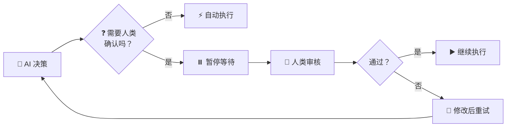
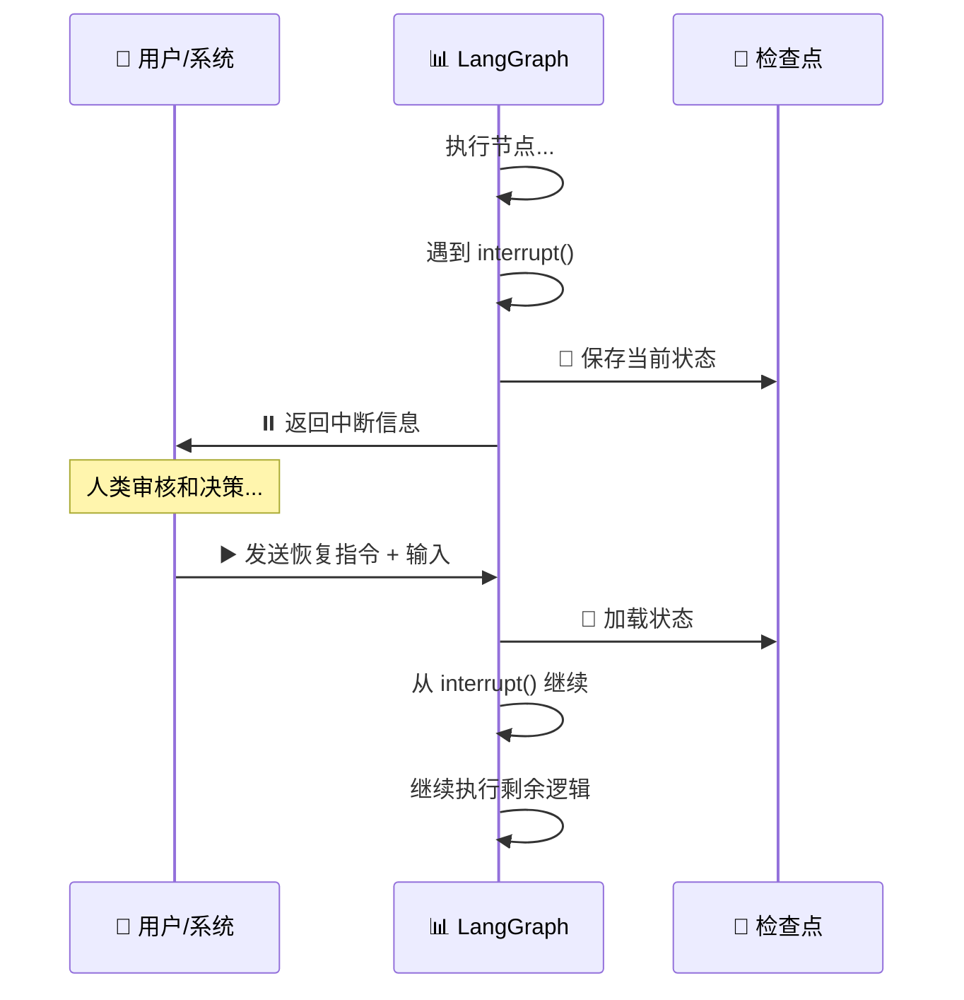
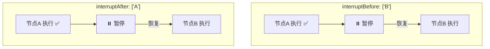
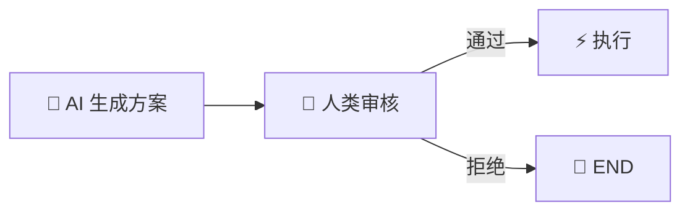
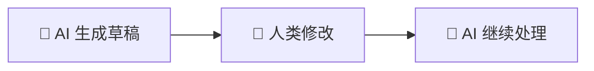
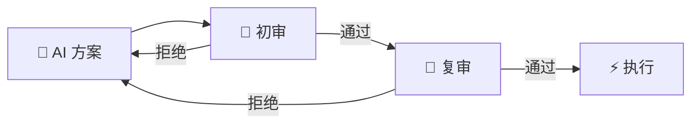
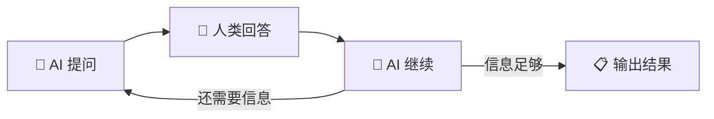

# 🤝 第九章：人机协作（Human-in-the-Loop）

> 本章将讲解 LangGraph 如何实现 AI 与人类的协作，包括中断/恢复机制、人类审批、手动修正等模式。

---

## 🎯 本章目标

- 理解人机协作的必要性和设计理念
- 掌握 `interrupt` / `resume` 机制
- 学会实现审批、确认、修正等交互模式
- 理解 `interruptBefore` 和 `interruptAfter` 的区别

---

## 📖 为什么需要人机协作？

AI 很强大，但在某些场景下，我们**不能完全信任 AI 的决策**：

| 场景 | 为什么需要人类参与 |
|------|------------------|
| 💰 金融交易 | AI 判断的转账金额可能有误 |
| 📧 发送邮件 | 邮件内容可能不恰当 |
| 🗑️ 删除数据 | 不可逆操作需要确认 |
| 📋 合同审批 | 法律文件需要人工审核 |
| 🔧 工具调用 | AI 选择的工具参数可能需要调整 |



---

## 1️⃣ interrupt —— 暂停机制

### 基本概念

`interrupt()` 函数可以在节点执行过程中**暂停整个图的执行**，等待外部输入（人类或系统）。

```typescript
import { interrupt } from "@langchain/langgraph";

const myNode = async (state) => {
  // 执行一些逻辑...
  const draft = generateEmail(state);

  // ⏸️ 暂停！等待人类确认
  const humanResponse = interrupt({
    question: "是否发送这封邮件？",
    draft: draft,
  });

  // ▶️ 人类确认后，继续执行
  if (humanResponse === "approve") {
    await sendEmail(draft);
  }

  return { status: "completed" };
};
```

### 工作原理



> ⚠️ **重要**：`interrupt` 需要配合 **Checkpointer** 使用！因为暂停后需要保存状态，恢复时才能继续。

---

## 2️⃣ interruptBefore / interruptAfter

### 编译时配置中断点

你可以在编译图时指定在哪些节点**之前**或**之后**暂停：

```typescript
const app = graph.compile({
  checkpointer: new MemorySaver(),
  interruptBefore: ["send_email"],    // 在发邮件前暂停
  interruptAfter: ["generate_draft"],  // 在生成草稿后暂停
});
```

### interruptBefore vs interruptAfter



看起来效果类似，但有关键区别：

| 特性 | interruptBefore | interruptAfter |
|------|----------------|----------------|
| **暂停时机** | 目标节点执行**前** | 目标节点执行**后** |
| **状态内容** | 不包含目标节点的输出 | 包含目标节点的输出 |
| **典型用途** | 审批后再执行危险操作 | 查看结果后决定是否继续 |
| **修改机会** | 可以修改输入后再执行 | 可以修改输出后再继续 |

---

## 3️⃣ 实战示例：邮件审批系统

```typescript
import {
  StateGraph,
  Annotation,
  START,
  END,
  MemorySaver,
  interrupt,
} from "@langchain/langgraph";

const EmailState = Annotation.Root({
  to: Annotation<string>,
  subject: Annotation<string>,
  body: Annotation<string>,
  approved: Annotation<boolean>,
  status: Annotation<string>,
  logs: Annotation<string[]>({
    reducer: (a, b) => [...a, ...b],
    default: () => [],
  }),
});

// 📝 生成邮件草稿
const generateDraft = async (state: typeof EmailState.State) => {
  const body = `尊敬的${state.to}：\n\n${state.body}\n\n此致敬礼`;
  return {
    body,
    status: "draft_ready",
    logs: ["📝 邮件草稿已生成"],
  };
};

// ✋ 人工审核节点
const humanReview = async (state: typeof EmailState.State) => {
  // ⏸️ 暂停执行，等待人类输入
  const decision = interrupt({
    message: "请审核以下邮件：",
    to: state.to,
    subject: state.subject,
    body: state.body,
    options: ["approve", "reject", "edit"],
  });

  // 人类恢复后，decision 就是传入的值
  if (decision === "approve") {
    return {
      approved: true,
      logs: ["✅ 人工审核通过"],
    };
  } else if (decision === "reject") {
    return {
      approved: false,
      status: "rejected",
      logs: ["❌ 人工审核拒绝"],
    };
  } else {
    // edit 的情况：人类会通过 updateState 修改邮件内容
    return {
      logs: ["✏️ 人工修改了邮件内容"],
    };
  }
};

// 📧 发送邮件
const sendEmail = async (state: typeof EmailState.State) => {
  if (!state.approved) {
    return {
      status: "cancelled",
      logs: ["🚫 邮件发送已取消"],
    };
  }

  // 模拟发送
  console.log(`📧 发送邮件到 ${state.to}: ${state.subject}`);
  return {
    status: "sent",
    logs: [`📧 邮件已发送到 ${state.to}`],
  };
};

// 路由
const reviewRouter = (state: typeof EmailState.State) => {
  if (state.approved) return "send";
  return "__end__";
};

// 构建图
const graph = new StateGraph(EmailState)
  .addNode("draft", generateDraft)
  .addNode("review", humanReview)
  .addNode("send", sendEmail)
  .addEdge(START, "draft")
  .addEdge("draft", "review")
  .addConditionalEdges("review", reviewRouter, {
    send: "send",
    __end__: END,
  })
  .addEdge("send", END);

const app = graph.compile({
  checkpointer: new MemorySaver(),
});

// ============ 使用流程 ============

const config = { configurable: { thread_id: "email-001" } };

// 第一步：提交邮件请求
console.log("1️⃣ 提交邮件请求...");
const result1 = await app.invoke(
  {
    to: "张经理",
    subject: "项目进展报告",
    body: "项目已完成80%，预计下周交付。",
  },
  config
);

// 此时图会在 interrupt() 处暂停
console.log("状态:", result1.status);  // "draft_ready"
console.log("日志:", result1.logs);

// 查看暂停状态
const state = await app.getState(config);
console.log("下一步:", state.next);    // ["review"] - 等待审核

// 第二步：人类审核通过
console.log("\n2️⃣ 人类审核...");
const result2 = await app.invoke(
  // 恢复时传入 Command 来提供 resume 值
  null,
  {
    ...config,
    // 通过 Command 的 resume 恢复 interrupt
  }
);

// 注意：实际恢复的方式是使用 Command
// import { Command } from "@langchain/langgraph";
// const result2 = await app.invoke(new Command({ resume: "approve" }), config);
```

---

## 4️⃣ 使用 Command 恢复中断

`Command` 是恢复中断的标准方式：

```typescript
import { Command } from "@langchain/langgraph";

// 场景1：简单确认
await app.invoke(
  new Command({ resume: "approve" }),
  config
);

// 场景2：传递复杂数据
await app.invoke(
  new Command({
    resume: {
      decision: "approve",
      comment: "内容很好，可以发送",
      modifier: "添加抄送：李总",
    },
  }),
  config
);

// 场景3：同时修改状态并恢复
await app.invoke(
  new Command({
    update: {
      body: "修改后的邮件内容...",
    },
    resume: "approve",
  }),
  config
);
```

---

## 5️⃣ 常见的人机协作模式

### 模式一：审批/确认



### 模式二：修正后继续



### 模式三：多级审批



### 模式四：输入收集



---

## 6️⃣ 设计考虑

### 为什么 interrupt 需要 Checkpointer？

```
中断 = 暂停执行 + 保存状态 + 等待 + 恢复状态 + 继续执行

没有 Checkpointer：
⏸️ 暂停 → 💥 状态丢失 → ❌ 无法恢复

有 Checkpointer：
⏸️ 暂停 → 💾 保存状态 → ⏳ 等待（可以是几天）→ 📂 恢复状态 → ▶️ 继续
```

### interrupt vs interruptBefore/After 的选择

| 方式 | 优点 | 缺点 | 推荐场景 |
|------|------|------|---------|
| `interrupt()` 函数 | 精确控制暂停位置 | 需要修改节点代码 | 复杂的交互逻辑 |
| `interruptBefore` | 不修改节点代码 | 只能在节点边界暂停 | 简单的审批场景 |
| `interruptAfter` | 可以查看节点输出 | 只能在节点边界暂停 | 结果确认场景 |

---

## 📝 本章小结

| 知识点 | 说明 |
|-------|------|
| **interrupt()** | 在节点内部暂停执行 |
| **interruptBefore** | 在指定节点执行前暂停 |
| **interruptAfter** | 在指定节点执行后暂停 |
| **Command({ resume })** | 恢复中断并传入数据 |
| **Checkpointer** | 人机协作的前提条件 |
| **thread_id** | 标识独立的会话/工作流 |

---

## 🎬 下一步

理解了人机协作后，让我们来看 LangGraph 提供的开箱即用的预构建代理：

👉 [第十章：预构建代理](./10-prebuilt-agents.md)

---

[← 上一章](./08-streaming.md) | [📖 返回目录](./README.md) | [下一章 →](./10-prebuilt-agents.md)
