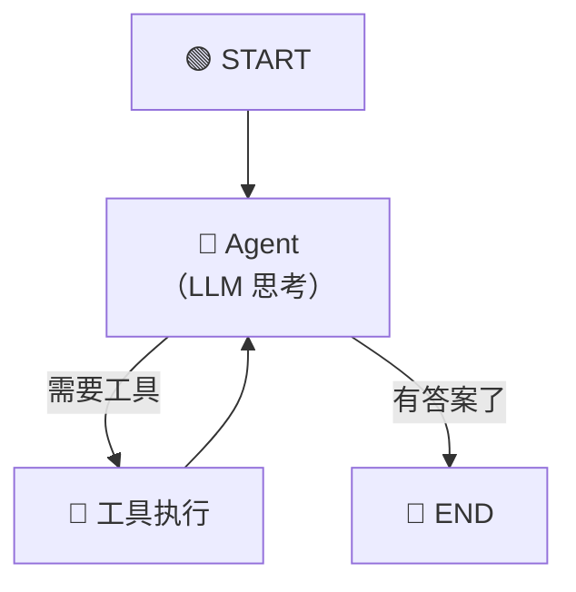
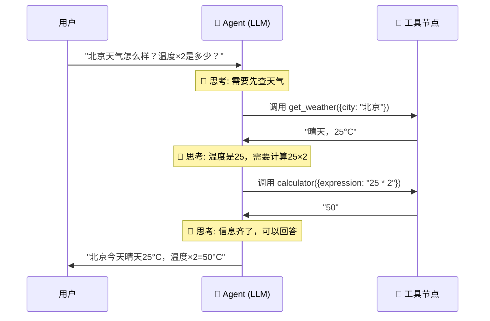
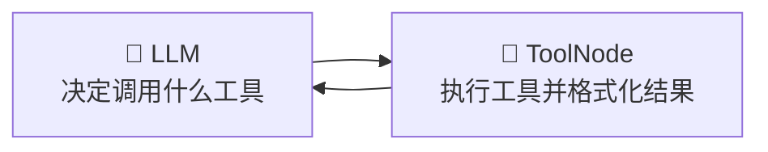
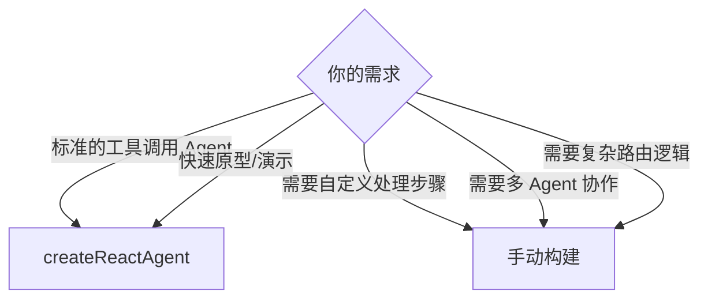

# 🤖 第十章：预构建代理与工具节点

> 本章将介绍 LangGraph 提供的开箱即用组件，让你快速构建功能完善的 AI Agent。

---

## 🎯 本章目标

- 理解 ReAct Agent 模式
- 学会使用 `createReactAgent`
- 掌握 ToolNode 的使用
- 了解如何自定义预构建组件

---

## 📖 什么是 ReAct Agent？

### ReAct = Reasoning + Acting

ReAct 是一种经典的 AI Agent 模式，它模拟了人类解决问题的方式：

```
🤔 思考（Reasoning）：分析当前情况，决定下一步
🔧 行动（Acting）：调用工具获取信息
👀 观察（Observation）：查看工具返回的结果
🔁 循环：基于观察继续思考，直到得出答案
```



### 生活类比

想象你是一个**侦探**在破案：

1. **思考**：凶手可能是谁？需要什么线索？
2. **行动**：去现场取证、查监控、问证人
3. **观察**：取证结果显示...
4. **再思考**：根据新线索，排除了A，B可能性更大
5. **再行动**：去调查B的不在场证明
6. **最终结论**：凶手是B！

这就是 ReAct Agent 的工作方式——LLM（大侦探）通过反复"思考-行动-观察"的循环来解决问题。

---

## 1️⃣ createReactAgent —— 一行代码创建 Agent

### 基本用法

```typescript
import { createReactAgent } from "@langchain/langgraph/prebuilt";
import { ChatOpenAI } from "@langchain/openai";
import { tool } from "@langchain/core/tools";
import { z } from "zod";

// 1. 创建 LLM
const model = new ChatOpenAI({
  model: "gpt-4",
  temperature: 0,
});

// 2. 定义工具
const weatherTool = tool(
  async ({ city }) => {
    // 模拟天气查询
    const data: Record<string, string> = {
      "北京": "晴天，25°C",
      "上海": "多云，22°C",
      "广州": "小雨，28°C",
    };
    return data[city] || "未找到该城市天气信息";
  },
  {
    name: "get_weather",
    description: "查询指定城市的天气",
    schema: z.object({
      city: z.string().describe("城市名称"),
    }),
  }
);

const calculatorTool = tool(
  async ({ expression }) => {
    try {
      // 注意：实际项目中不要用 eval，这里仅做演示
      return String(eval(expression));
    } catch {
      return "计算出错";
    }
  },
  {
    name: "calculator",
    description: "计算数学表达式",
    schema: z.object({
      expression: z.string().describe("数学表达式，如 '2 + 3 * 4'"),
    }),
  }
);

// 3. 一行代码创建 Agent！
const agent = createReactAgent({
  llm: model,
  tools: [weatherTool, calculatorTool],
});

// 4. 使用
const result = await agent.invoke({
  messages: [
    { role: "user", content: "北京今天天气怎么样？如果温度乘以2是多少？" },
  ],
});

console.log(result.messages.at(-1)?.content);
```

### 执行流程



---

## 2️⃣ createReactAgent 的配置选项

```typescript
const agent = createReactAgent({
  // 必需参数
  llm: model,             // LLM 模型
  tools: [tool1, tool2],  // 工具列表

  // 可选参数
  // 系统提示词 —— 定义 Agent 的角色和行为
  prompt: "你是一个专业的数据分析助手。回答要简洁准确。",

  // 检查点 —— 支持多轮对话
  checkpointSaver: new MemorySaver(),

  // 消息修改器 —— 在发送给 LLM 前修改消息
  messageModifier: (messages) => {
    // 例：只保留最近10条消息，避免 token 超限
    return messages.slice(-10);
  },

  // 中断配置 —— 人机协作
  interruptBefore: ["tools"],  // 执行工具前暂停
  interruptAfter: ["tools"],   // 执行工具后暂停
});
```

---

## 3️⃣ ToolNode —— 工具执行节点

### 什么是 ToolNode？

`ToolNode` 是一个预构建的节点，专门负责执行 LLM 要求调用的工具。



### 单独使用 ToolNode

```typescript
import { ToolNode } from "@langchain/langgraph/prebuilt";
import { tool } from "@langchain/core/tools";
import { z } from "zod";

// 定义工具
const searchTool = tool(
  async ({ query }) => `搜索结果: 关于"${query}"的信息...`,
  {
    name: "search",
    description: "搜索信息",
    schema: z.object({ query: z.string() }),
  }
);

// 创建 ToolNode
const toolNode = new ToolNode([searchTool]);

// ToolNode 接受包含 tool_calls 的消息
// 通常由 LLM 自动生成
```

### 在自定义图中使用 ToolNode

```typescript
import {
  StateGraph,
  Annotation,
  START,
  END,
  messagesStateReducer,
} from "@langchain/langgraph";
import { ToolNode } from "@langchain/langgraph/prebuilt";
import { BaseMessage, AIMessage } from "@langchain/core/messages";

const AgentState = Annotation.Root({
  messages: Annotation<BaseMessage[]>({
    reducer: messagesStateReducer,
    default: () => [],
  }),
});

// 自定义 Agent 节点
const agentNode = async (state: typeof AgentState.State) => {
  const response = await model.invoke(state.messages);
  return { messages: [response] };
};

// 路由函数
const shouldContinue = (state: typeof AgentState.State) => {
  const lastMessage = state.messages.at(-1) as AIMessage;
  if (lastMessage?.tool_calls && lastMessage.tool_calls.length > 0) {
    return "tools";
  }
  return "__end__";
};

// 创建 ToolNode
const toolNode = new ToolNode([searchTool, calculatorTool]);

// 构建图
const graph = new StateGraph(AgentState)
  .addNode("agent", agentNode)
  .addNode("tools", toolNode)
  .addEdge(START, "agent")
  .addConditionalEdges("agent", shouldContinue, {
    tools: "tools",
    __end__: END,
  })
  .addEdge("tools", "agent");

const app = graph.compile();
```

---

## 4️⃣ 自定义工具的最佳实践

### 工具定义规范

```typescript
import { tool } from "@langchain/core/tools";
import { z } from "zod";

const myTool = tool(
  // 1. 实现函数
  async (input) => {
    // 执行逻辑
    return "结果";
  },
  {
    // 2. 工具名称（唯一标识）
    name: "tool_name",

    // 3. 描述（LLM 据此决定何时使用）
    description: "清晰描述工具的功能、输入要求、返回内容",

    // 4. 参数 Schema（使用 zod 定义）
    schema: z.object({
      param1: z.string().describe("参数1的说明"),
      param2: z.number().optional().describe("可选参数"),
    }),
  }
);
```

### 🔑 描述写好很关键

LLM 根据工具的 **name** 和 **description** 来决定使用哪个工具。所以：

```typescript
// ❌ 不好的描述
const badTool = tool(fn, {
  name: "t1",
  description: "处理数据",
  schema: z.object({ d: z.string() }),
});

// ✅ 好的描述
const goodTool = tool(fn, {
  name: "search_database",
  description:
    "在产品数据库中搜索商品信息。输入商品名称或关键词，返回匹配的商品列表（包括名称、价格、库存）。当用户询问商品信息、价格、库存时使用此工具。",
  schema: z.object({
    query: z.string().describe("搜索关键词，如商品名称、类别"),
    limit: z.number().optional().describe("返回结果数量限制，默认10"),
  }),
});
```

---

## 5️⃣ createReactAgent vs 手动构建

| 特性 | createReactAgent | 手动构建 |
|------|-----------------|---------|
| **代码量** | 1行 | 30+ 行 |
| **灵活性** | 中等 | 完全自由 |
| **自定义节点** | 不支持 | 支持 |
| **自定义路由** | 有限 | 完全自由 |
| **学习成本** | ⭐ 低 | ⭐⭐⭐ 中 |
| **适用场景** | 标准 ReAct Agent | 复杂自定义 Agent |

### 选择建议



---

## 6️⃣ 预构建组件一览

LangGraph 提供了多种预构建组件：

| 组件 | 说明 | 包路径 |
|------|------|--------|
| `createReactAgent` | ReAct 模式 Agent | `@langchain/langgraph/prebuilt` |
| `ToolNode` | 工具执行节点 | `@langchain/langgraph/prebuilt` |
| `messagesStateReducer` | 消息状态 Reducer | `@langchain/langgraph` |

### 专用代理模式

此外还有一些专门的代理模式包：

| 包 | 模式 | 说明 |
|---|------|------|
| `@langchain/langgraph-supervisor` | 主管模式 | 一个 AI "主管"分配任务给其他 Agent |
| `@langchain/langgraph-swarm` | 群体模式 | 多个 Agent 自主协作、对等通信 |

---

## 📝 本章小结

| 知识点 | 说明 |
|-------|------|
| **ReAct 模式** | 思考→行动→观察→循环 |
| **createReactAgent** | 一行代码创建标准 Agent |
| **ToolNode** | 执行工具的预构建节点 |
| **tool()** | 工具定义函数，配合 zod schema |
| **工具描述** | LLM 选择工具的依据，要写清楚 |

---

## 🎬 下一步

掌握了预构建组件后，让我们学习更高级的设计模式：

👉 [第十一章：高级模式](./11-advanced-patterns.md)

---

[← 上一章](./09-human-in-the-loop.md) | [📖 返回目录](./README.md) | [下一章 →](./11-advanced-patterns.md)
