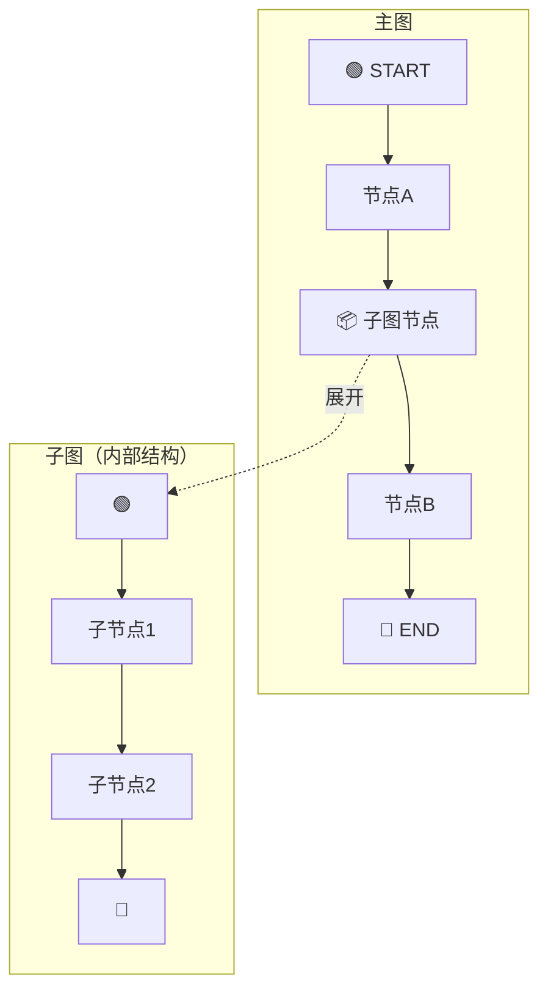
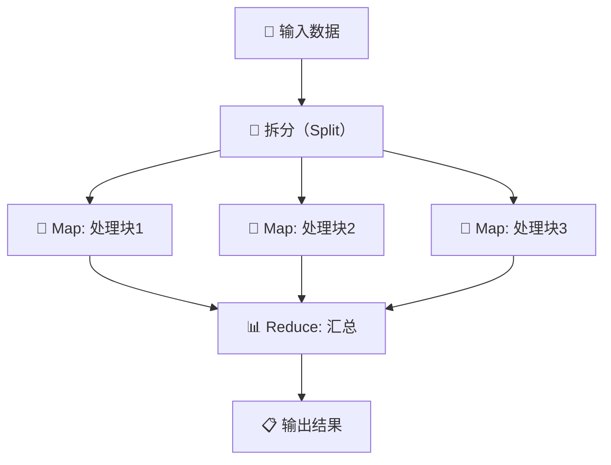
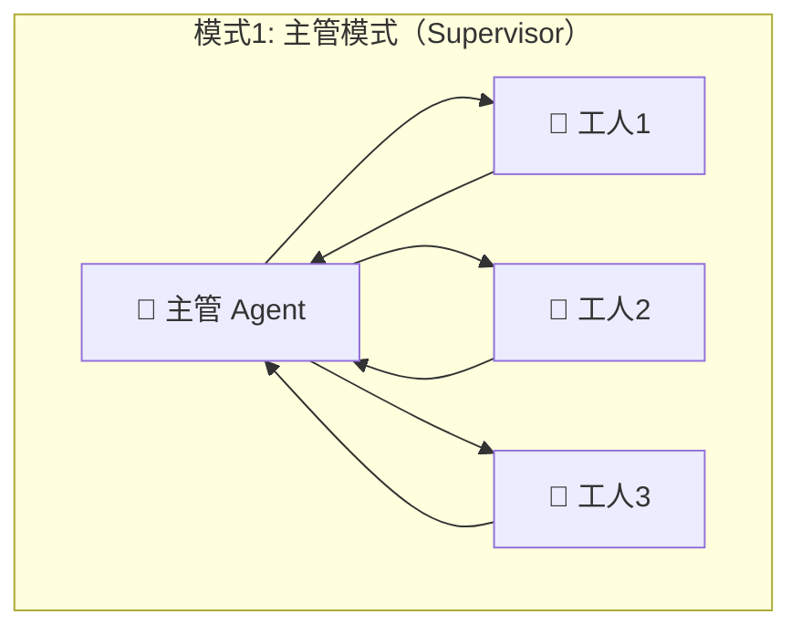
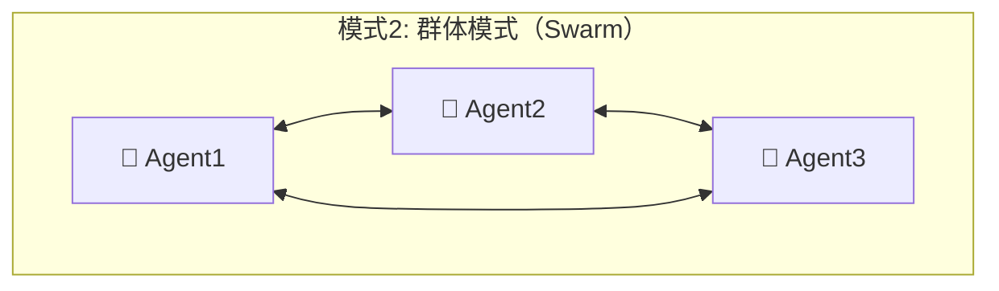
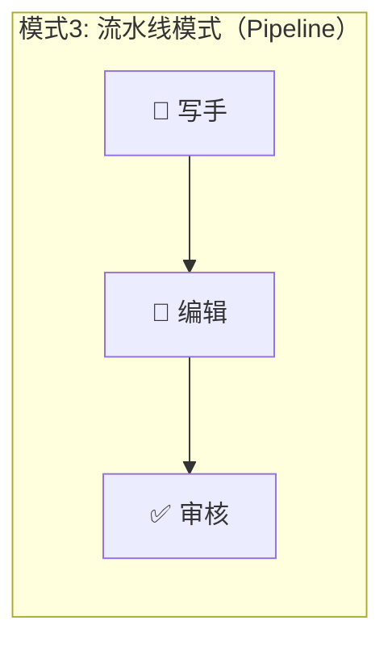
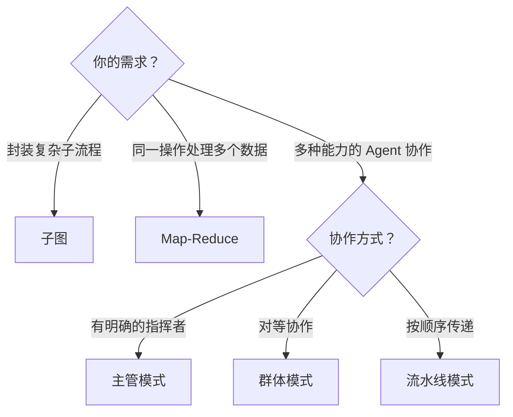
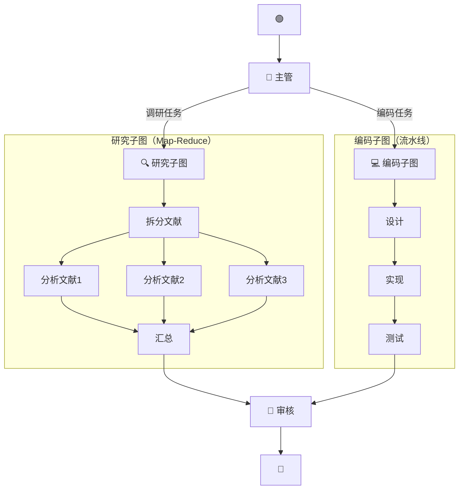

# 🏗️ 第十一章：高级模式

> 本章将介绍 LangGraph 的高级设计模式，包括子图、Map-Reduce 并行处理、多代理系统等。

---

## 🎯 本章目标

- 理解子图（Subgraph）的概念和使用场景
- 掌握 Map-Reduce 并行处理模式
- 了解多代理系统的设计方式
- 学会组合这些模式构建复杂应用

---

## 1️⃣ 子图（Subgraph）

### 什么是子图？

子图就是**图中的图**——把一个完整的图作为另一个图的一个节点使用。



### 生活类比

想象你在管理一个**大型项目**：
- **主图** = 项目管理流程（需求分析 → 开发 → 测试 → 上线）
- **子图** = "开发"这个步骤展开后的详细流程（前端开发 → 后端开发 → 联调）

你不需要在项目管理层面关心开发的内部细节，只关心"开发完成了没"。

### 为什么需要子图？

| 优势 | 说明 |
|------|------|
| 🧩 **模块化** | 复杂逻辑封装在子图内部 |
| 🔄 **复用** | 同一个子图可以在多个地方使用 |
| 🔒 **隔离** | 子图有独立的状态空间 |
| 🎯 **关注点分离** | 每个团队维护自己的子图 |

### 代码示例

```typescript
import { StateGraph, Annotation, START, END } from "@langchain/langgraph";

// ============ 定义子图 ============
const SubgraphState = Annotation.Root({
  input: Annotation<string>,
  result: Annotation<string>,
  steps: Annotation<string[]>({
    reducer: (a, b) => [...a, ...b],
    default: () => [],
  }),
});

const subStep1 = async (state: typeof SubgraphState.State) => ({
  steps: ["子步骤1: 预处理"],
  result: `预处理(${state.input})`,
});

const subStep2 = async (state: typeof SubgraphState.State) => ({
  steps: ["子步骤2: 核心处理"],
  result: `核心处理(${state.result})`,
});

const subgraph = new StateGraph(SubgraphState)
  .addNode("sub_step1", subStep1)
  .addNode("sub_step2", subStep2)
  .addEdge(START, "sub_step1")
  .addEdge("sub_step1", "sub_step2")
  .addEdge("sub_step2", END)
  .compile();

// ============ 定义主图 ============
const MainState = Annotation.Root({
  input: Annotation<string>,
  result: Annotation<string>,
  logs: Annotation<string[]>({
    reducer: (a, b) => [...a, ...b],
    default: () => [],
  }),
});

const preprocess = async (state: typeof MainState.State) => ({
  logs: ["主图: 预处理完成"],
});

// 子图作为节点函数
const subgraphNode = async (state: typeof MainState.State) => {
  // 调用子图
  const result = await subgraph.invoke({
    input: state.input,
  });

  return {
    result: result.result,
    logs: [`主图: 子图执行完成, 步骤: ${result.steps.join(" → ")}`],
  };
};

const postprocess = async (state: typeof MainState.State) => ({
  result: `最终结果: ${state.result}`,
  logs: ["主图: 后处理完成"],
});

// 构建主图
const mainGraph = new StateGraph(MainState)
  .addNode("preprocess", preprocess)
  .addNode("subgraph", subgraphNode)
  .addNode("postprocess", postprocess)
  .addEdge(START, "preprocess")
  .addEdge("preprocess", "subgraph")
  .addEdge("subgraph", "postprocess")
  .addEdge("postprocess", END);

const app = mainGraph.compile();

const result = await app.invoke({ input: "Hello" });
console.log("结果:", result.result);
console.log("日志:", result.logs);
```

---

## 2️⃣ Map-Reduce 并行处理

### 什么是 Map-Reduce？



- **Map**：将同一个操作应用到多个数据块上（并行）
- **Reduce**：将多个结果汇总为一个最终结果

### 使用 Send 实现 Map-Reduce

```typescript
import { StateGraph, Annotation, START, END, Send } from "@langchain/langgraph";

// 状态定义
const MapReduceState = Annotation.Root({
  documents: Annotation<string[]>,
  summaries: Annotation<string[]>({
    reducer: (a, b) => [...a, ...b],
    default: () => [],
  }),
  finalSummary: Annotation<string>,
});

// Map 阶段：拆分并分发
const splitDocuments = (state: typeof MapReduceState.State) => {
  // 使用 Send 为每个文档创建独立的处理任务
  return state.documents.map(
    (doc, index) =>
      new Send("process_document", {
        documents: [doc],
        summaries: [],
      })
  );
};

// Map 阶段：处理单个文档
const processDocument = async (state: typeof MapReduceState.State) => {
  const doc = state.documents[0];
  // 模拟文档处理（实际可以调用 LLM）
  const summary = `📝 ${doc.slice(0, 15)}... 的摘要`;
  console.log(`处理文档: ${summary}`);
  return { summaries: [summary] };
};

// Reduce 阶段：汇总所有摘要
const reduceSummaries = async (state: typeof MapReduceState.State) => {
  const finalSummary = [
    `📊 汇总报告（共 ${state.summaries.length} 篇）`,
    "═".repeat(40),
    ...state.summaries.map((s, i) => `${i + 1}. ${s}`),
    "═".repeat(40),
    "总结：以上文档涵盖了多个方面的内容。",
  ].join("\n");

  return { finalSummary };
};

// 构建图
const graph = new StateGraph(MapReduceState)
  .addNode("process_document", processDocument)
  .addNode("reduce", reduceSummaries)
  .addConditionalEdges(START, splitDocuments)
  .addEdge("process_document", "reduce")
  .addEdge("reduce", END);

const app = graph.compile();

const result = await app.invoke({
  documents: [
    "人工智能正在改变医疗诊断的方式，通过图像识别技术...",
    "自动驾驶技术的发展依赖于深度学习和传感器融合...",
    "自然语言处理使得机器能够理解和生成人类语言...",
    "强化学习在游戏领域取得了超越人类的表现...",
  ],
});

console.log(result.finalSummary);
```

**输出**：

```
📊 汇总报告（共 4 篇）
════════════════════════════════════════
1. 📝 人工智能正在改变医疗诊断... 的摘要
2. 📝 自动驾驶技术的发展依赖... 的摘要
3. 📝 自然语言处理使得机器能够... 的摘要
4. 📝 强化学习在游戏领域取得了... 的摘要
════════════════════════════════════════
总结：以上文档涵盖了多个方面的内容。
```

---

## 3️⃣ 多代理系统（Multi-Agent）

### 常见的多代理架构







### 主管模式示例

```typescript
import { StateGraph, Annotation, START, END, Command } from "@langchain/langgraph";

const TeamState = Annotation.Root({
  task: Annotation<string>,
  messages: Annotation<string[]>({
    reducer: (a, b) => [...a, ...b],
    default: () => [],
  }),
  currentAgent: Annotation<string>,
  result: Annotation<string>,
});

// 👔 主管 Agent：分配任务
const supervisor = async (state: typeof TeamState.State) => {
  const task = state.task.toLowerCase();

  // 根据任务类型分配给不同的 Agent
  if (task.includes("代码") || task.includes("编程")) {
    return new Command({
      update: {
        currentAgent: "coder",
        messages: ["👔 主管: 这是编程任务，交给程序员"],
      },
      goto: "coder",
    });
  } else if (task.includes("写作") || task.includes("文章")) {
    return new Command({
      update: {
        currentAgent: "writer",
        messages: ["👔 主管: 这是写作任务，交给写手"],
      },
      goto: "writer",
    });
  } else {
    return new Command({
      update: {
        currentAgent: "researcher",
        messages: ["👔 主管: 需要先调研，交给研究员"],
      },
      goto: "researcher",
    });
  }
};

// 👨‍💻 程序员 Agent
const coder = async (state: typeof TeamState.State) => ({
  result: `[代码] ${state.task} 的实现方案...`,
  messages: ["👨‍💻 程序员: 代码已完成"],
});

// ✍️ 写手 Agent
const writerAgent = async (state: typeof TeamState.State) => ({
  result: `[文章] 关于"${state.task}"的文章...`,
  messages: ["✍️ 写手: 文章已完成"],
});

// 🔍 研究员 Agent
const researcher = async (state: typeof TeamState.State) => ({
  result: `[报告] ${state.task} 的调研报告...`,
  messages: ["🔍 研究员: 调研完成"],
});

// 构建图
const graph = new StateGraph(TeamState)
  .addNode("supervisor", supervisor)
  .addNode("coder", coder)
  .addNode("writer", writerAgent)
  .addNode("researcher", researcher)
  .addEdge(START, "supervisor")
  // supervisor 使用 Command 内部路由
  .addEdge("coder", END)
  .addEdge("writer", END)
  .addEdge("researcher", END);

const app = graph.compile();

// 测试
const r1 = await app.invoke({ task: "写一篇关于AI的文章" });
console.log("结果:", r1.result);
console.log("消息:", r1.messages);
```

---

## 4️⃣ 模式对比与选择

| 模式 | 适用场景 | 复杂度 | 灵活性 |
|------|---------|:------:|:------:|
| **子图** | 封装复杂子流程 | ⭐⭐ | ⭐⭐⭐ |
| **Map-Reduce** | 批量并行处理 | ⭐⭐ | ⭐⭐ |
| **主管模式** | 任务分配、团队协作 | ⭐⭐⭐ | ⭐⭐⭐ |
| **群体模式** | 对等协作、复杂交互 | ⭐⭐⭐⭐ | ⭐⭐⭐⭐ |
| **流水线模式** | 顺序处理链 | ⭐ | ⭐⭐ |

### 选择决策树



---

## 5️⃣ 组合使用

在实际项目中，你经常需要**组合多种模式**：



---

## 📝 本章小结

| 模式 | 核心思想 | 关键 API |
|------|---------|---------|
| **子图** | 图中嵌套图 | `subgraph.invoke()` |
| **Map-Reduce** | 拆分→并行处理→汇总 | `Send` |
| **主管模式** | 中心化任务分配 | `Command({ goto })` |
| **群体模式** | 去中心化协作 | 多 Agent 互相路由 |
| **流水线** | 顺序传递处理 | `addEdge` 链式连接 |

---

## 🎬 下一步

了解了各种高级模式后，让我们最后深入 LangGraph 的底层架构——Pregel 执行引擎的原理：

👉 [第十二章：架构深度解析](./12-architecture.md)

---

[← 上一章](./10-prebuilt-agents.md) | [📖 返回目录](./README.md) | [下一章 →](./12-architecture.md)
