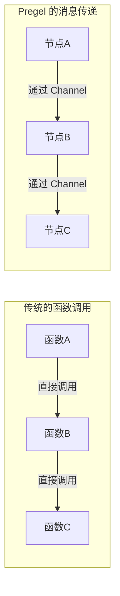
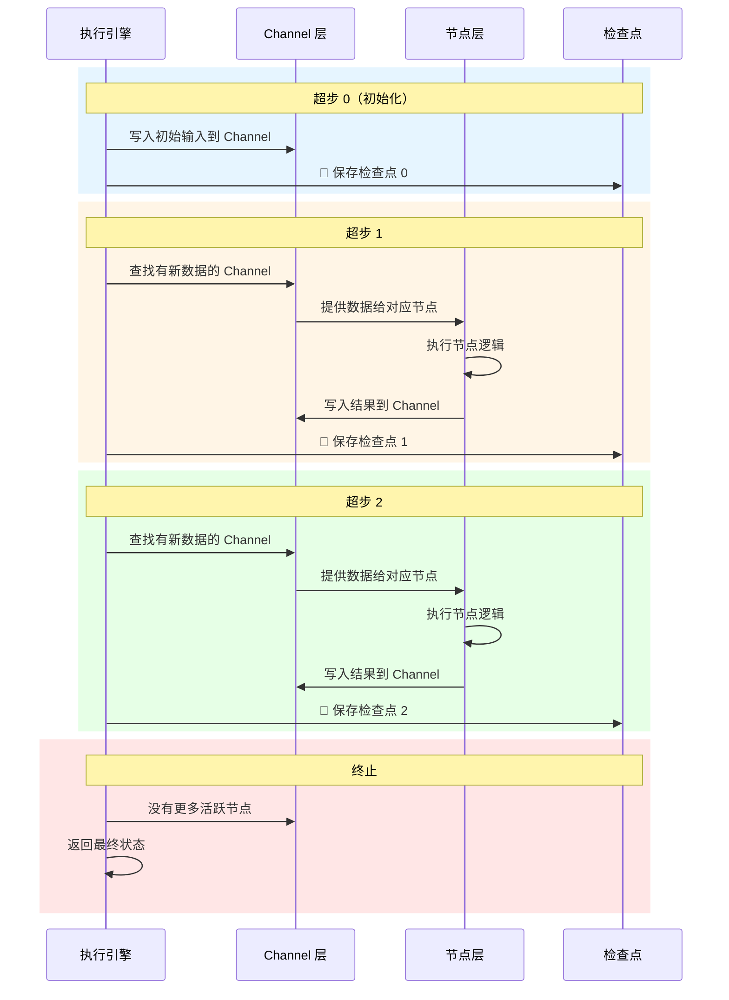
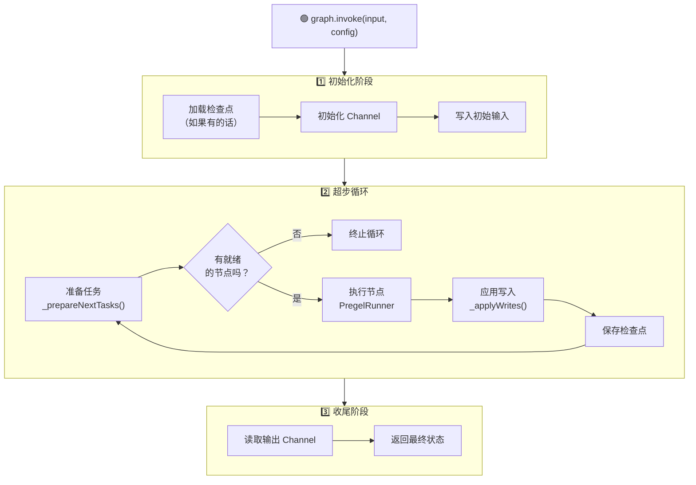
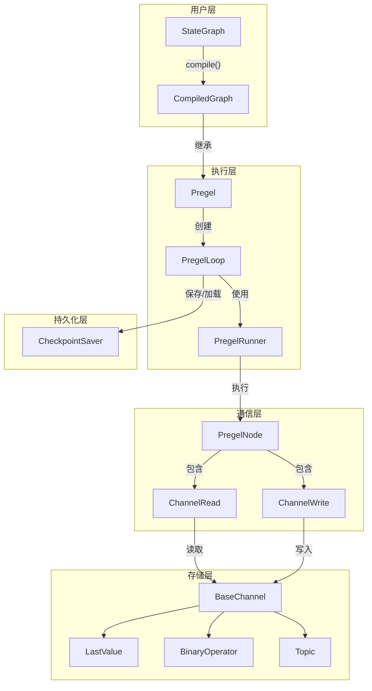
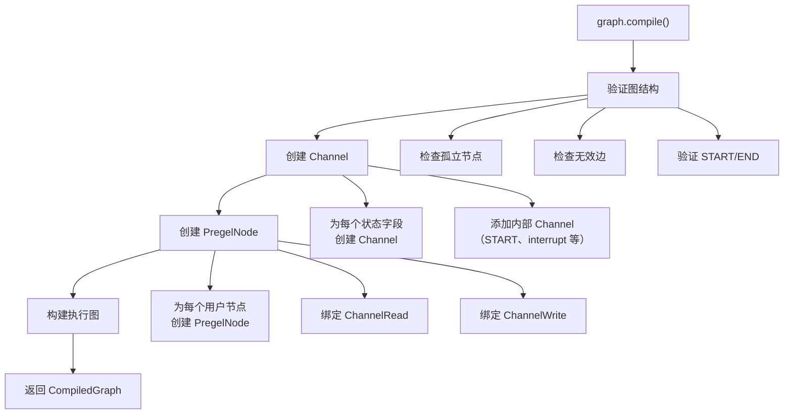
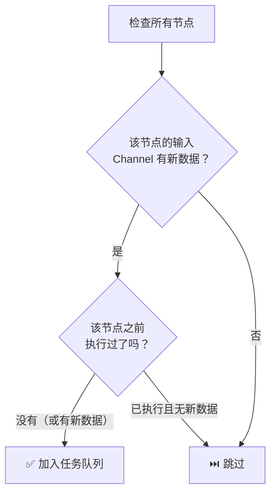
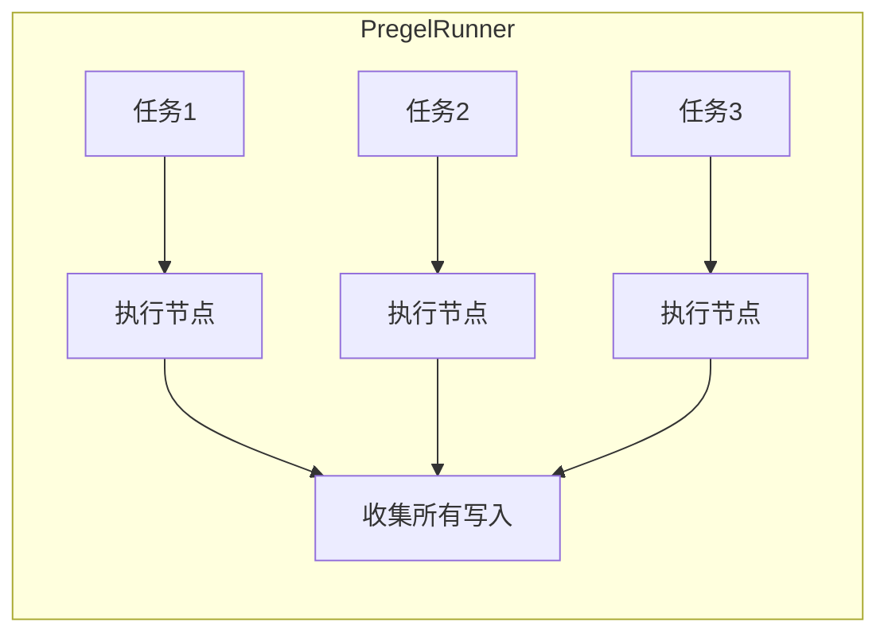
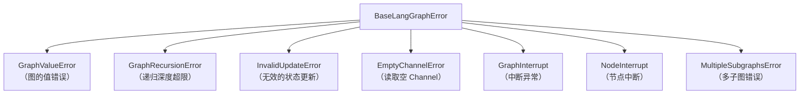
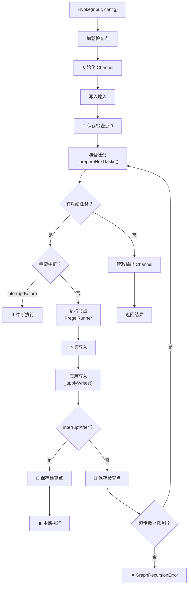
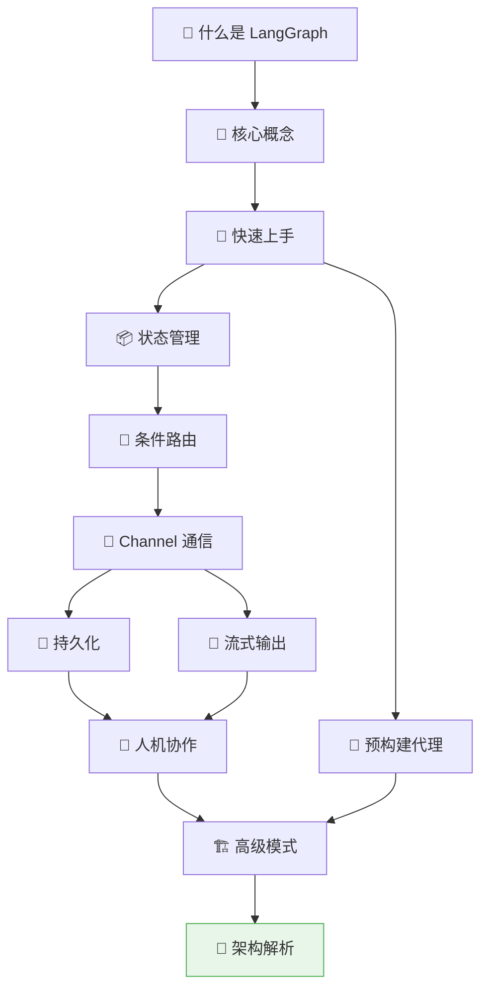

# 🔬 第十二章：架构深度解析 —— Pregel 引擎原理

> 本章将深入 LangGraph 的核心引擎，揭示 Pregel 算法的工作原理、执行生命周期和内部架构。这是理解 LangGraph 最底层的一章。

---

## 🎯 本章目标

- 理解 Pregel 算法的起源和设计思想
- 掌握 LangGraph 的执行生命周期
- 理解超步（Superstep）的运作机制
- 了解内部架构中各组件的协作方式

---

## 📖 Pregel 算法的起源

### Google 的 Pregel 论文

2010 年，Google 发表了论文《Pregel: A System for Large-Scale Graph Processing》，提出了一种高效处理大规模图数据的计算模型。

> 📄 **论文核心思想**：图中的每个顶点可以独立计算，通过消息传递与其他顶点通信，整个计算过程分为多个同步的"超步"。

### 为什么 LangGraph 选择 Pregel？



| 特性 | 直接调用 | Pregel 消息传递 |
|------|---------|---------------|
| 耦合度 | 高（直接依赖） | 低（通过 Channel 解耦） |
| 可中断性 | 困难 | 天然支持（在超步间暂停） |
| 可持久化 | 困难 | 天然支持（Channel 可序列化） |
| 可并行性 | 需手动管理 | 自动并行（同一超步内） |
| 可观察性 | 需额外工作 | 天然支持（Channel 可监控） |

---

## 1️⃣ 超步（Superstep）模型

### 什么是超步？

超步是 Pregel 执行的**基本时间单元**。每个超步中：

1. **读取**：每个活跃节点从 Channel 读取输入
2. **计算**：节点执行自己的逻辑
3. **写入**：节点将结果写入 Channel
4. **同步**：等待所有活跃节点完成



### 超步的类比

把超步想象成一个**棋类游戏**的"回合"：

```
回合1: 白方所有棋子可以行动 → 黑方所有棋子可以行动 → 回合结束
回合2: 白方所有棋子可以行动 → 黑方所有棋子可以行动 → 回合结束
...
游戏结束: 一方获胜（或平局）
```

在每个回合中：
- 所有可以行动的棋子**同时**决策（并行）
- 行动结果在回合结束时**一起生效**（同步）
- 如果没有棋子需要行动，游戏结束（终止条件）

---

## 2️⃣ 执行生命周期

### 完整的执行流程



### 各阶段详解

#### 阶段一：初始化

```typescript
// 伪代码
async function initialize(input, config) {
  // 1. 检查是否有检查点
  const checkpoint = await checkpointer?.get(config);

  // 2. 初始化所有 Channel
  for (const [name, channel] of channels) {
    if (checkpoint) {
      channel.fromCheckpoint(checkpoint.channel_values[name]);
    } else {
      channel.fromCheckpoint(undefined); // 使用默认值
    }
  }

  // 3. 将输入写入起始 Channel
  inputChannel.update([input]);
}
```

#### 阶段二：超步循环

```typescript
// 伪代码
async function superStepLoop() {
  while (true) {
    // 1. 找出哪些节点可以执行
    const tasks = prepareNextTasks();

    if (tasks.length === 0) {
      break; // 没有节点需要执行，终止
    }

    // 2. 执行节点（可能并行）
    const results = await runner.execute(tasks);

    // 3. 将节点的输出写入 Channel
    for (const result of results) {
      applyWrites(result.writes);
    }

    // 4. 保存检查点
    await saveCheckpoint();

    // 5. 发送流式事件
    emitStreamEvents(results);
  }
}
```

#### 阶段三：收尾

```typescript
// 伪代码
function finalize() {
  // 读取输出 Channel 的值作为最终结果
  const output = {};
  for (const [name, channel] of outputChannels) {
    output[name] = channel.get();
  }
  return output;
}
```

---

## 3️⃣ 内部架构

### 核心类的协作关系



### 各组件职责

| 组件 | 文件 | 职责 |
|------|------|------|
| **StateGraph** | `graph/state.ts` | 提供用户友好的图定义 API |
| **CompiledGraph** | `graph/graph.ts` | 编译后的图，继承自 Pregel |
| **Pregel** | `pregel/index.ts` | 核心执行引擎 |
| **PregelLoop** | `pregel/loop.ts` | 管理超步循环 |
| **PregelRunner** | `pregel/runner.ts` | 执行节点任务 |
| **PregelNode** | `pregel/read.ts` | 包装节点函数，绑定 Channel 读写 |
| **ChannelRead** | `pregel/read.ts` | 从 Channel 读取数据 |
| **ChannelWrite** | `pregel/write.ts` | 向 Channel 写入数据 |
| **BaseChannel** | `channels/base.ts` | Channel 抽象基类 |

---

## 4️⃣ 编译过程详解

当你调用 `graph.compile()` 时，发生了什么？



### 从用户代码到执行引擎

```typescript
// 你写的代码
const graph = new StateGraph(MyState)
  .addNode("agent", agentFn)
  .addEdge(START, "agent")
  .addEdge("agent", END);

// 编译后生成的内部结构（伪代码）
{
  channels: {
    "__start__": new EphemeralValue(),     // START Channel
    "messages": new BinaryOperator(reducer), // 状态 Channel
    "count": new LastValue(),              // 状态 Channel
  },
  nodes: {
    "agent": new PregelNode({
      channels: ["messages", "count"],   // 读取哪些 Channel
      writers: [ChannelWrite(...)],       // 写入哪些 Channel
      bound: agentFn,                     // 实际执行的函数
    }),
  },
  edges: {
    "__start__" -> "agent",
    "agent" -> "__end__",
  }
}
```

---

## 5️⃣ 任务准备与执行

### _prepareNextTasks —— 决定谁可以执行



核心逻辑：

```typescript
// 简化版
function prepareNextTasks(channels, nodes, prevVersions) {
  const tasks = [];

  for (const [name, node] of nodes) {
    // 检查节点订阅的 Channel 是否有更新
    const hasUpdates = node.triggers.some(
      (ch) => channels[ch].version > (prevVersions[name]?.[ch] ?? 0)
    );

    if (hasUpdates) {
      tasks.push({
        name,
        input: readChannels(channels, node.channels),
        proc: node.bound,
      });
    }
  }

  return tasks;
}
```

### PregelRunner —— 执行任务



- 同一超步内的任务可以**并行**执行
- 每个任务的写入被收集起来，在超步结束时**一起应用**

---

## 6️⃣ 错误处理与重试

### 错误类型层次



### 递归保护

LangGraph 有内置的递归深度限制，防止无限循环：

```typescript
// 默认最大递归深度是 25
const app = graph.compile();

// 可以自定义
const result = await app.invoke(input, {
  recursionLimit: 50, // 最多 50 个超步
});
```

> 🤔 **为什么需要递归限制？**
>
> 如果你的图有循环（比如 Agent 反复调用工具），可能会出现无限循环。递归限制是一个安全阀。

---

## 7️⃣ 完整执行流程图



---

## 📝 本章小结

| 概念 | 说明 |
|------|------|
| **Pregel** | Google 提出的分布式图计算模型 |
| **超步** | 执行的基本时间单元，同步屏障 |
| **Channel** | 节点间通信的媒介 |
| **PregelLoop** | 管理超步循环的组件 |
| **PregelRunner** | 执行节点任务的组件 |
| **递归限制** | 防止无限循环的安全机制 |
| **_prepareNextTasks** | 决定哪些节点可以执行 |
| **_applyWrites** | 将节点输出写入 Channel |

---

## 🎉 恭喜完成！

你已经完成了整个 LangGraph.js 由浅入深教程！让我们回顾一下学到的内容：



### 📚 继续学习的建议

1. **动手实践**：尝试修改教程中的代码示例
2. **阅读源码**：从 `graph/state.ts` 开始，逐步深入
3. **查看示例**：仓库的 `examples/` 目录有丰富的实战项目
4. **参与社区**：在 GitHub Issues/Discussions 中提问和讨论
5. **构建项目**：尝试用 LangGraph 解决一个实际问题

---

[← 上一章](./11-advanced-patterns.md) | [📖 返回目录](./README.md)
