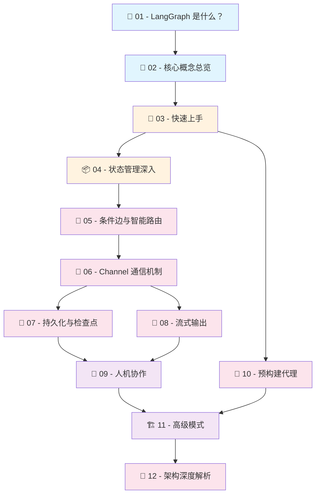

# 🦜🕸️ LangGraph.js 由浅入深学习教程

> **LangGraph.js** 是一个基于 TypeScript/JavaScript 的低级别智能体编排框架，用于构建可控的、有状态的多步骤 AI 工作流。本教程将带你从零开始，逐步深入掌握 LangGraph 的核心概念和实战技巧。

---

## 📋 教程目录

| 序号 | 章节 | 难度 | 说明 |
|:---:|------|:---:|------|
| 01 | [🌟 LangGraph 是什么？](./01-introduction.md) | ⭐ | 了解 LangGraph 的定位、解决的问题、与其他框架的对比 |
| 02 | [🧩 核心概念总览](./02-core-concepts.md) | ⭐ | Graph、Node、Edge、State 四大基础概念 |
| 03 | [🚀 快速上手](./03-quick-start.md) | ⭐⭐ | 动手构建你的第一个 LangGraph 图 |
| 04 | [📦 状态管理深入](./04-state-management.md) | ⭐⭐ | Annotation、Reducer 与类型安全的状态定义 |
| 05 | [🔀 条件边与智能路由](./05-conditional-edges.md) | ⭐⭐⭐ | 条件分支、动态路由、Send 和 Command |
| 06 | [📡 Channel 通信机制](./06-channels.md) | ⭐⭐⭐ | 节点间通信的底层原理 |
| 07 | [💾 持久化与检查点](./07-checkpointer.md) | ⭐⭐⭐ | Checkpoint 机制、状态恢复、时间旅行调试 |
| 08 | [🌊 流式输出](./08-streaming.md) | ⭐⭐⭐ | 多种 StreamMode 与实时数据流 |
| 09 | [🤝 人机协作](./09-human-in-the-loop.md) | ⭐⭐⭐⭐ | interrupt/resume 机制实现人类审批与干预 |
| 10 | [🤖 预构建代理](./10-prebuilt-agents.md) | ⭐⭐⭐ | 开箱即用的 ReAct Agent 与工具节点 |
| 11 | [🏗️ 高级模式](./11-advanced-patterns.md) | ⭐⭐⭐⭐ | 子图、Map-Reduce、多代理系统 |
| 12 | [🔬 架构深度解析](./12-architecture.md) | ⭐⭐⭐⭐⭐ | Pregel 引擎原理、执行生命周期 |

---

## 🗺️ 学习路线图



### 📖 推荐学习路径

- **🟢 入门阶段**（1-3 章）：理解基本概念，能搭建简单的图
- **🟡 进阶阶段**（4-8 章）：掌握状态管理、路由、通信、持久化等核心功能
- **🔴 高级阶段**（9-12 章）：学习人机协作、高级模式和底层架构原理

---

## 🛠️ 环境准备

### 安装依赖

```bash
# 安装核心包
npm install @langchain/langgraph @langchain/core

# 如果需要 LLM 支持（以 OpenAI 为例）
npm install @langchain/openai

# 如果需要持久化
npm install @langchain/langgraph-checkpoint
```

### TypeScript 配置

```json
{
  "compilerOptions": {
    "target": "ES2021",
    "module": "NodeNext",
    "moduleResolution": "NodeNext",
    "strict": true,
    "esModuleInterop": true,
    "outDir": "./dist"
  }
}
```

---

## 📚 参考资源

- 📖 [LangGraph.js 官方文档](https://langchain-ai.github.io/langgraphjs/)
- 🐙 [GitHub 仓库](https://github.com/langchain-ai/langgraphjs)
- 🐍 [LangGraph Python 版本](https://github.com/langchain-ai/langgraph)
- 📝 [LangChain 官方文档](https://js.langchain.com/)
- 💬 [LangChain 社区](https://github.com/langchain-ai/langgraphjs/discussions)

---

## 📄 许可说明

本教程基于 LangGraph.js 开源仓库编写，仅用于学习交流目的。

---

> 💡 **提示**：建议按照目录顺序由浅入深学习，每个章节都有代码示例，建议动手实践。
